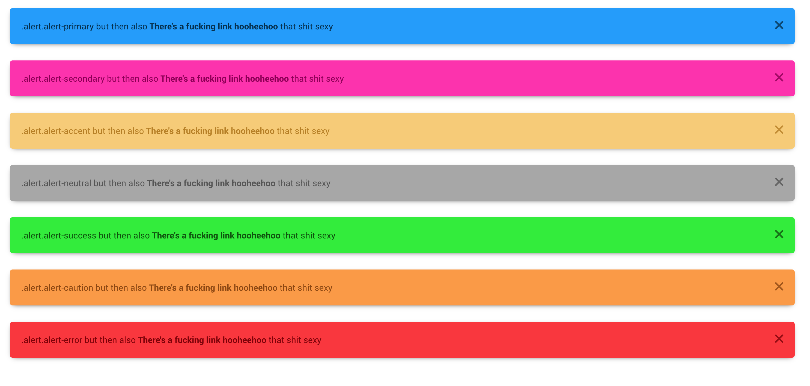
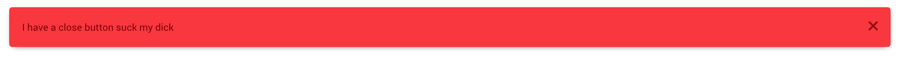

# Alerts

We got it now yay! set up ya alert like this and it should be good

```html
<div class="alert alert-default">
	Sup motherfucker I'm an alert and I'm here to fuck up your life
</div>
```


## Color classes

Other styles are available in the framework aside from `.alert-default`

These are valid color classes for your boi

*	`.alert-primary`
*	`.alert-accent`
*	`.alert-neutral`
*	`.alert-error`
*	`.alert-caution`
*	`.alert-success`



[More info on colors](../../sections/scaffolding/colors.md)

## Toggler

### **`[data-toggle=alert-close]`**

Elements with this attribute looks for an alert to close

### **`.alert-close`**

Offsets an element inside `.alert` to the top right side as if it where the close button for our boi

Combine both so you can do magical things <3


### Code Examples

This one looks for the `href` of the boi
```html
<a href="#bitch-alert" class="btn btn-default" data-toggle="alert-close">Close Alert</a>
<div class="alert alert-error" id="bitch-alert">
	<!-- Close butt -->

	I have a close button suck my dick
</div>
```


This one looks for the `data-href` of the boi
```html
<span data-href="#bitch-alert" class="btn btn-default" data-toggle="alert-close">Close Alert</span>
<div class="alert alert-error" id="bitch-alert">
	<!-- Close butt -->

	I have a close button suck my dick
</div>
```


This one looks for the `.alert` ancestor and it's a close symbol because it looks cuter and also using `.alert-close`
```html
<div class="alert alert-error" id="bitch-alert">
	<!-- Close butt -->
	<a href="#bitch-alert" class="alert-close" data-toggle="alert-close"><i class="symbol symbol-close"></i></a>

	I have a close button suck my dick
</div>
```




### **`[data-toggle=alert-close-all]`**

Well what if there's too many notifications and the user is too overwhelmed by the amount and you wanna give them the ability to close all them alerty bois?

Set this data attribute to a bitch up no href or data-href required... it just.. destroys eveRYTHING THAT HAS AN `.alert-close` INNIIIIT

```html
	<a href="#bitch-alert" class="btn btn-default" data-toggle="alert-close-all">Clear Notifications... good lord this is too much</a>
	<div class="alert alert-error" id="bitch-alert">
		ALERT! HAHAHAHAHAHAH
	</div>
	<div class="alert alert-error" id="bitch-alert">
		ALERT! HAHAHAHAHAHAH
	</div>
	<div class="alert alert-error" id="bitch-alert">
		ALERT! HAHAHAHAHAHAH
	</div>
	<div class="alert alert-error" id="bitch-alert">
		ALERT! HAHAHAHAHAHAH
	</div>
	<div class="alert alert-error" id="bitch-alert">
		ALERT! HAHAHAHAHAHAH
	</div>
	<div class="alert alert-error" id="bitch-alert">
		ALERT! HAHAHAHAHAHAH
	</div>
	<div class="alert alert-error" id="bitch-alert">
		ALERT! HAHAHAHAHAHAH
	</div>
	<div class="alert alert-error" id="bitch-alert">
		ALERT! HAHAHAHAHAHAH
	</div>
	<div class="alert alert-error" id="bitch-alert">
		ALERT! HAHAHAHAHAHAH
	</div>
	<div class="alert alert-error" id="bitch-alert">
		ALERT! HAHAHAHAHAHAH
	</div>
```

[Back to TOC](../../../readme.md)