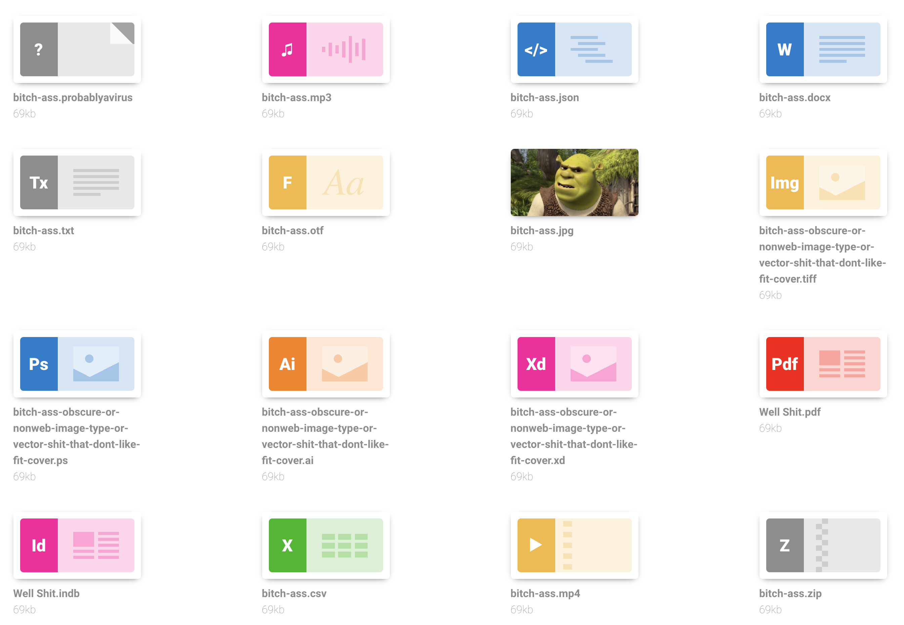

# Asset

Markup to display files, or `figure`s but fancier

A typical setup could look like this

```html
<div class="asset">
	<div class="asset-thumbnail">
		<span class="asset-image asset-image-default"></span>
	</div>
	<a href="#" class="asset-delete btn btn-symbo btn-small btn-secondary">
		<i class="symbol symbol-close"></i>
	</a>
	<p class="asset-title">bitch-ass.probablyavirus</p>
	<p class="asset-caption">69kb</p>
</div>
```




# Classes

## `.asset`

Containing element


## `.asset-thumbnail`

Container of thumbnail. can contain either an `` for a thumbnail or the helper class `.asset-image`


## `.asset-image`

helper that can display a css coded thumbnail for file types. append one of of the classes below to this to work:

### supported file type classes:


| asset-image-class | file types suggested for.. |
|--|:--|
| `.asset-image-default` | anything duh |
| `.asset-image-audio` | wav,mp3,wma if that still exists, m4a etc. |
| `.asset-image-code` | json,css,html,xml etc |
| `.asset-image-text` | txt or rich text idk |
| `.asset-image-doc` | doc,docx etc |
| `.asset-image-font` | otf,ttf eot etc |
| `.asset-image-img` | jpg,png,gif,tiff,bmp etc |
| `.asset-image-ps` | psd,psb,raw,pxr |
| `.asset-image-ai` | ai |
| `.asset-image-xd` | xd |
| `.asset-image-pdf` | duh |
| `.asset-image-id` | indd,indb,idml,indl,indt,xqx,pmd,inx |
| `.asset-image-table` | excel files, csv,tsv.. |
| `.asset-image-video` | mp4, quicktime etc |
| `.asset-image-zip` | zip.. probably a rar file tooo idk |


## `.asset-delete` and `[data-toggle="asset-close"]`

Bitches been deprecated. never use it again

## `.asset-functions` and `.asset-function`

`.asset-functions` is used to style and contain functionalities you want an asset to have.

wrap form controllers or buttons innit with `.asset-function`


```html
<div class="asset">
	<div class="asset-thumbnail">
		<span class="asset-image asset-image-default"></span>
	</div>
	<div class="asset-functions">
		<!-- Delete -->
			<div class="asset-function">
				<a href="#" class="btn btn-symbol btn-round btn-small btn-secondary">
					<i class="symbol symbol-delete"></i>
				</a>
			</div>
		<!-- Edit -->
			<div class="asset-function">
				<a href="#" class="btn btn-symbol btn-round btn-small btn-secondary">
					<i class="symbol symbol-edit"></i>
				</a>
			</div>
	</div>
	<p class="asset-title">bitch-ass.probablyavirus</p>
	<p class="asset-caption">69kb</p>
</div>
```

## `.asset-title` and `.asset-caption`

duh


[Back to TOC](../../../readme.md)