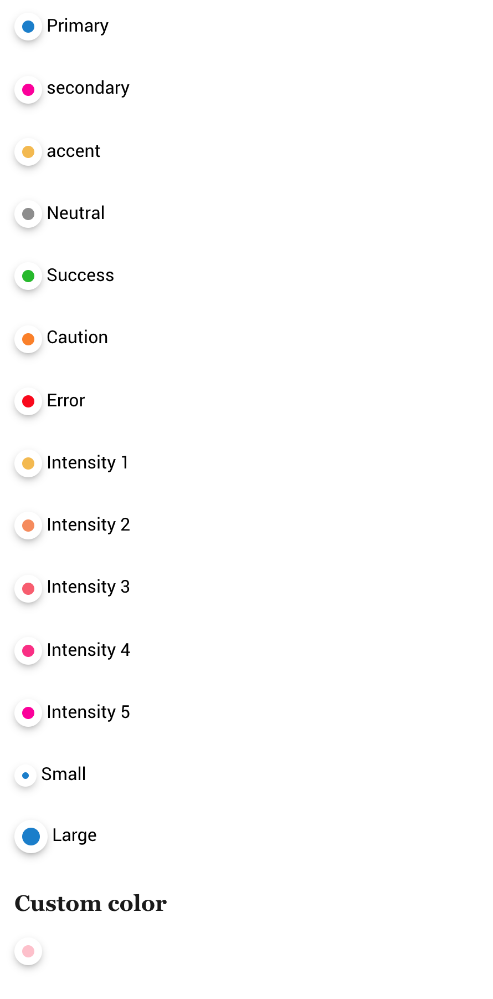

# Badges

This is to display.. a circle boi.. :)

```html
<span class="badge badge-primary"></span> Primary 
```


## Colors

To color the badges, add `.badge-[color-tag]`

*	**`.badge-primary`**
*	**`.badge-secondary`**
*	**`.badge-accent`**
*	**`.badge-neutral`**
*	**`.badge-error`**
*	**`.badge-caution`**
*	**`.badge-success`**
*	**`.badge-intensity-1`**
*	**`.badge-intensity-2`**
*	**`.badge-intensity-3`**
*	**`.badge-intensity-4`**
*	**`.badge-intensity-5`**

More info on [color tags](../scaffolding/colors.md#color-tags)

The color can be customized by adding a background-color property to the badge

```html
<span class="badge" style="background-color:pink;"></span> Primary 
```

## Size

### **`.badge-large`**

Make the boi larger

### **`.badge-small`**

Make the boi small



Look at them. so round. so precious


[Back to TOC](../../../readme.md)