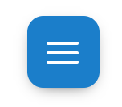
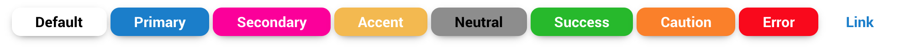
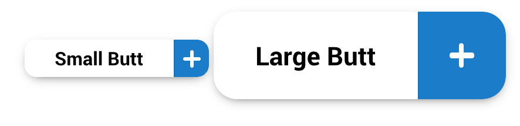

# Buttons

Get ready bois this is gonna be a doozy

A button... is a button using the class **`.btn`**


best works on `button`, `a`, `span` classy bois


```html
<button type="button" class="btn btn-default">Default</button>
```

`.btn` sets up a boi for button styling. `.btn-default` adds default butt styles

## Button itself helpers

### Button colors

Other styles are available in the framework aside from `.btn-default`

To color the butts, add `.btn-[color-tag]`

*	**`.btn-primary`**
*	**`.btn-secondary`**
*	**`.btn-accent`**
*	**`.btn-neutral`**
*	**`.btn-error`**
*	**`.btn-caution`**
*	**`.btn-success`**

To style a button like it's a basic link (but it's not hihihi) use **`.btn-link`**


```html
<button type="button" class="btn btn-default">Default</button>
<button type="button" class="btn btn-primary">Primary</button>
<button type="button" class="btn btn-secondary">secondary</button>
<button type="button" class="btn btn-accent">accent</button>
<button type="button" class="btn btn-neutral">neutral</button>
<button type="button" class="btn btn-success">Success</button>
<button type="button" class="btn btn-caution">caution</button>
<button type="button" class="btn btn-error">error</button>
<button type="button" class="btn btn-link">Link</button>
```


More info on [color tags](../scaffolding/colors.md#color-tags)

#### Custom button colors
1.	Make your own custom class that sets a `border-color`,`background`, and `color`
2.	You can style the font-family too but whatever
3.	add interactive styles too if you want
4.	ya done

An example:
```css
.btn-ugly {
	border-color: yellow;
	background: green;
	color: blue;
}

.btn-ugly:hover {
	border-color: brown;
	background: black;
	color: purple;
}
```


### Other Btn Helpers

#### **`.btn-block`**

`.btn` takes full width on set [max mobile breakpoint](../scaffolding/breakpoint.md#mobile-split)


#### **`.btn-symbol`**

Makes a square boi. very nice for [symbols](../components/symbol.md)

```html
<button type="button" class="btn btn-symbol btn-default">
	<i class="symbol symbol-burger"></i>
</button>
```

NOTE: this btn will always stay a equilateral boi even in `.btn-group`



#### **`.btn-round`**

Makes the edges of your `.btn` half circle round. If used on a `.btn-symbol`, wi make the button a circle :O

```html
<button type="button" class="btn btn-round btn-default">
	my edges are round like the fuCKING EARTH
</button>
```


# Button Groups

There are times when you make a button group, or a button made of button styled children. This is your friend by wrapping `.btn` elements in **`.btn-group`**

A button made of button styled bois

```html
<button class="btn-group btn-group-horizontal">
	<span class="btn btn-default"><strong>00:00</strong> Hours</span>
	<span class="btn btn-primary">Add Time to Project <i class="symbol symbol-plus"></i></span>
</button>
```


A container made of separate btn styles

```html
<div class="btn-group btn-group-horizontal">
	<a href="#" class="btn btn-default"><strong>00:00</strong> Hours</a>
	<a href="#" class="btn btn-primary">Add Time to Project <i class="symbol symbol-plus"></i></a>
</div>
```

## Basic examples

a `.btn-group` has to have either **`.btn-group-horizontal`** or **`.btn-group-vertical`** to make the group look nice

### Horizontal

```html
<button class="btn-group btn-group-horizontal">
	<span class="btn btn-default"><strong>00:00</strong> Hours</span>
	<span class="btn btn-primary">Add Time to Project <i class="symbol symbol-plus"></i></span>
</button>
```

NOTE if there are too much btns, there will be a scrollbar on the button group container to allow access to those but butts


### Vertical
```html
<div class="btn-group btn-group-vertical">
	<a href="#" class="btn btn-default">butt</a>
	<a href="#" class="btn btn-default btn-disabled">butt</a>
	<a href="#" class="btn btn-default">butt</a>
	<a href="#" class="btn btn-default">butt</a>
	<a href="#" class="btn btn-default">butt</a>
</div>
```


`.btn` styles also works in [`.input-group`](../components/form.md#input-group) containers... i hope

## Btn group helpers

### **`.btn-group-responsive`**

In case absolutely horizontal and vertical button groups look too ugly, use this to make vertical and horizontal groups vertically stack like blocks on [max mobile breakpoint](../scaffolding/breakpoint.md#mobile-split)


### **`.btn-group-block`**

Keep btn-group full width all the fucking time


### **`.btn-group-unite`**

In case you wanted the butt group styles to interact as a single button. this class cascades hover, focus and active styles to the btn children

### **`.btn-group-toggle`**

this toggles `.active` styles on butt butts


```html
<div class="btn-group btn-group-horizontal btn-group-toggle">
	<a href="#" class="btn btn-default">butt</a>
	<a href="#" class="btn btn-default">butt</a>
	<a href="#" class="btn btn-default">butt</a>
	<a href="#" class="btn btn-default">butt</a>
	<a href="#" class="btn btn-default">butt</a>
</div>
```


[Symbols toggle classes](../components/symbol.md) change based on the status of the butt as well as long as they are a direct children


#### **`.btn-group-toggle`** helpers

#####  **`.btn-group-toggle-multiple`**

Allows multiple active butt butts.

If you want one of the butts reset the active class, add **`.btn-group-toggle-reset`**

```html
<div class="btn-group btn-group-horizontal btn-group-toggle btn-group-toggle-multiple btn-group-responsive">
	<button type="button" class="active btn btn-default btn-group-toggle-reset"> All</button>
	<button type="button" class=" btn btn-default"> butt</button>
	<button type="button" class="btn btn-default">  Butt </button>
	<button type="button" class="btn btn-default">Butt</button>
	<button type="button" class="btn btn-default"> Butt</button>
</div>
```


# Button and Button Group Helpers

These helpers work on both `.btn` and `.btn-group`

## **`.btn-disabled`**

Styles the button as disabled and also prevents it from doing shit

```html

<a href="#" class="btn btn-disabled btn-default">Default</a>
<a href="#" class="btn btn-disabled btn-primary">Primary</a>
<a href="#" class="btn btn-disabled btn-secondary">secondary</a>
<a href="#" class="btn btn-disabled btn-accent">accent</a>
<a href="#" class="btn btn-disabled btn-neutral">neutral</a>
<a href="#" class="btn btn-disabled btn-success">Success</a>
<a href="#" class="btn btn-disabled btn-caution">caution</a>
<a href="#" class="btn btn-disabled btn-error">error</a>
<a href="#" class="btn btn-disabled btn-link">Link</a>
```


The whole group... DISABLED

```html
<button class="btn-group btn-group-horizontal btn-disabled">
	<span class="btn btn-default">Default</span>
	<span class="btn btn-primary">Primary</span>
	<span class="btn btn-secondary">secondary</span>
</button>
```


One of these bois are disabled... hmmm

```html
<div class="btn-group btn-group-vertical>
	<a href="#" class="btn btn-default">butt</a>
	<a href="#" class="btn btn-default btn-disabled">butt</a>
	<a href="#" class="btn btn-default">butt</a>
	<a href="#" class="btn btn-default">butt</a>
	<a href="#" class="btn btn-default">butt</a>
</div>
```


## Button size

### **`.btn-small`**

Add this class to make ya boi smaller

Individually

```html
<button type="button" class="btn btn-small btn-default">Default</button>
<button type="button" class="btn btn-small btn-primary">Primary</button>
<button type="button" class="btn btn-small btn-secondary">secondary</button>
<button type="button" class="btn btn-small btn-accent">accent</button>
<button type="button" class="btn btn-small btn-neutral">neutral</button>
<button type="button" class="btn btn-small btn-success">Success</button>
<button type="button" class="btn btn-small btn-caution">caution</button>
<button type="button" class="btn btn-small btn-error">error</button>
<button type="button" class="btn btn-small btn-link">Link</button>
```



### **`.btn-large`**

Add this class to make ya boi chonky

```html
<button type="button" class="btn btn-large btn-default">Default</button>
<button type="button" class="btn btn-large btn-primary">Primary</button>
<button type="button" class="btn btn-large btn-secondary">secondary</button>
<button type="button" class="btn btn-large btn-accent">accent</button>
<button type="button" class="btn btn-large btn-neutral">neutral</button>
<button type="button" class="btn btn-large btn-success">Success</button>
<button type="button" class="btn btn-large btn-caution">caution</button>
<button type="button" class="btn btn-large btn-error">error</button>
<button type="button" class="btn btn-large btn-link">Link</button>
```


### That shit works on `.btn-group` too yo

```html
<a class="btn-group btn-small btn-group-horizontal btn-group-unite">
	<span href="#" class="btn btn-default">Small butt</span>
	<span href="#" class="btn btn-primary btn-symbol"><i class="symbol symbol-plus"></i></span>
</a>

<a class="btn-group btn-large btn-group-horizontal btn-group-unite">
	<span href="#" class="btn btn-default">large butt</span>
	<span href="#" class="btn btn-primary btn-symbol"><i class="symbol symbol-plus"></i></span>
</a>
```



## **`.btn-no-interaction`**

Prevents hover,focus and active styles

## **`.btn-no-shadow`**

removes `box-shadow` in case you really dont want it there on some layouts

## **`.btn-no-radius`**

removes `border-radius` in case you really dont want it there on some layouts

[Back to TOC](../../../readme.md)