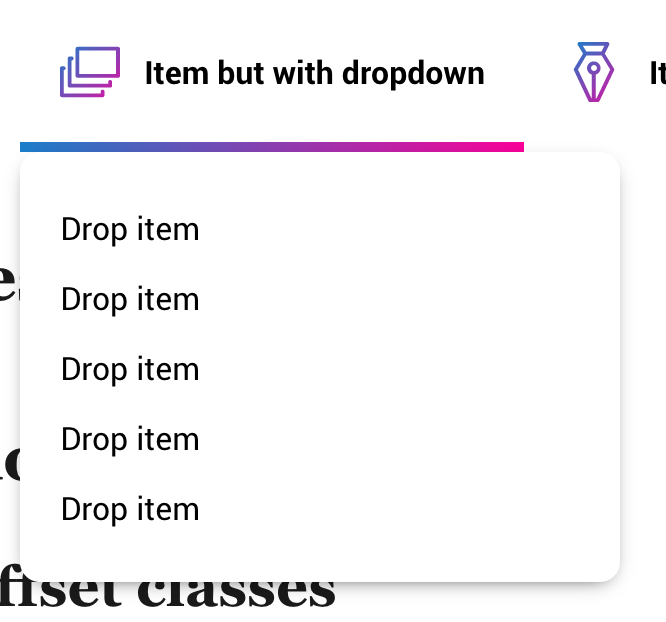
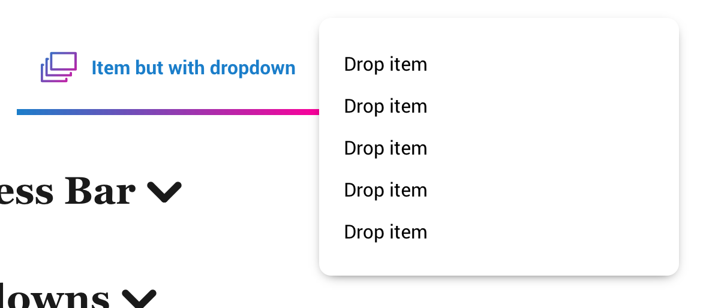
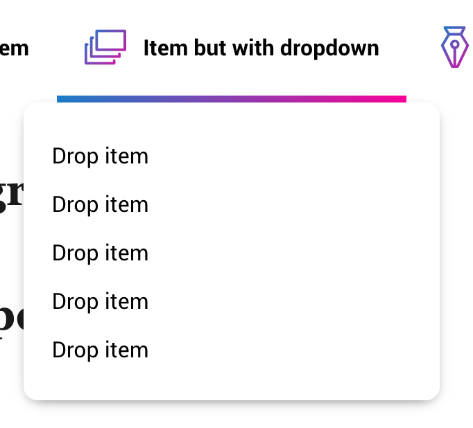

# Dropdown

Yes

Works with [nav items too](../componenets/../components/nav.md)

Shares some styles with [tooltip](../components/tooltip.md)


```html
<li class="nav-item">
	<a href="#a-dropdown" data-toggle="dropdown">
		
		<span class="nav-item-text">Item but with dropdown</span>
	</a>
	<ul class="dropdown" id="a-dropdown">
		<li><a href="#">Drop item</a></li>
		<li><a href="#">Drop item</a></li>
		<li><a href="#">Drop item</a></li>
		<li><a href="#">Drop item</a></li>
		<li><a href="#">Drop item</a></li>
	</ul>
</li>
```



## Toggler

### **`[data-toggle=dropdown]`**

Elements with this attribute looks for an dropdown to toggle

NOTE: this works on almost any clickable items. this will also work on input most types of fields or `[contenteditable="true]` elements


The most frequent setup [data-toggle="dropdown"] looks for a sibling because there's no `href` or `data-href`

```html
<div class="container">
	<span data-toggle="dropdown">Open a bitch</span>
	<div class="dropdown">
		Sup mofos, I'm an dropdown content
	</div>
</div>
```

This one looks for the `href` of the boi
```html
<a href="#bitch-ass-dropdown" data-toggle="dropdown">Open a bitch</a>
<div id="bitch-ass-dropdown" class="dropdown">
	Sup mofos, I'm an dropdown content
</div>
```

Another way but [data-toggle="dropdown"] looks for a `data-href` to go to because there's no `href`

```html
<span data-href="#bitch-ass-dropdown" data-toggle="dropdown">Open a bitch</span>
<div id="bitch-ass-dropdown" class="dropdown">
	Sup mofos, I'm an dropdown content
</div>
```

## **`.dropdown`**  and helpers

NOTE: this has to be contained in a positioned element so helpers will render nicely

You can position the dropdown however needed You can combine the classes as fit to position ya dropdown just right 


[More info on css positioning](https://www.w3schools.com/css/css_positioning.asp)

### Basic

*	**`.dropdown-left`**
*	**`.dropdown-left`**
*	**`.dropdown-right`**
*	**`.dropdown-top`**

These classes set the side mentioned in the class's position side offset to 0

Example:

```html
<div class="container">
	<span data-toggle="dropdown">Open a bitch</span>
	<div class="dropdown dropdown-left">
		Sup mofos, I'm an dropdown content
	</div>
</div>
```

This sets the dropdown at `left:0;`


```html
<div class="container">
	<span data-toggle="dropdown">Open a bitch</span>
	<div class="dropdown dropdown-right">
		Sup mofos, I'm an dropdown content
	</div>
</div>
```

This sets the dropdown at `right:0;`

These barely do much but if you combine them with...

### Flush

... You can make your dreams come true

*	**`.dropdown-left-flush`**
*	**`.dropdown-left-flush`**
*	**`.dropdown-right-flush`**
*	**`.dropdown-top-flush`**

These classes set the side mentioned in the class's position side offset to 100%

Example:

```html
<div class="container">
	<span data-toggle="dropdown">Open a bitch</span>
	<div class="dropdown dropdown-top dropdown-left-flush">
		Sup mofos, I'm an dropdown content
	</div>
</div>
```

this sets `left:100%` and `top:0;` to `.dropdown`




You can also do things like

### Centering


*	**`.dropdown-center-x`**
*	**`.dropdown-center-y`**

`.dropdown-center-x` centers the dropdown horizontally while `.dropdown-center-y` centers the bitch vertically


Example:

```html
<div class="container">
	<span data-toggle="dropdown">Open a bitch</span>
	<div class="dropdown dropdown-top-flush dropdown-center-x">
		Sup mofos, I'm an dropdown content
	</div>
</div>
```



You get it...

## Available Attributes


### **`[data-dropdown-width="['css width property']"]`**

Defaults to nothing, or closest positioned element's width

Can be applied to either `.dropdown` or `[data-toggle="dropdown"]`

This sets a custom width for the dropdown

### **`[data-dropdown-max-height="['css max-height property']"]`**

Defaults to nothing, or closest positioned element's max-height

Can be applied to either `.dropdown` or `[data-toggle="dropdown"]`

This sets a custom max-height for the dropdown

## Styling dropdown setup

Note that all descendants of `[data-toggle="dropdown"]` has pointer-events none to allow the toggle to do its thing without being bugged out by its content

`.dropdown` on the other hand has more extensive styles. If you don't need to style it, you can just not touch it... sometimes the [.nav](../components/nav.md) takes over for styles too


[Symbols toggle classes](../components/symbol.md#toggle-classes) change based on the status of the accordion as well as long as they are a direct children of either `[data-toggle="dropdown"]` or `.dropdown`

[Back to TOC](../../../readme.md)