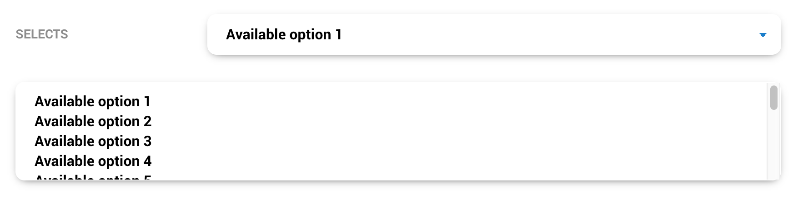
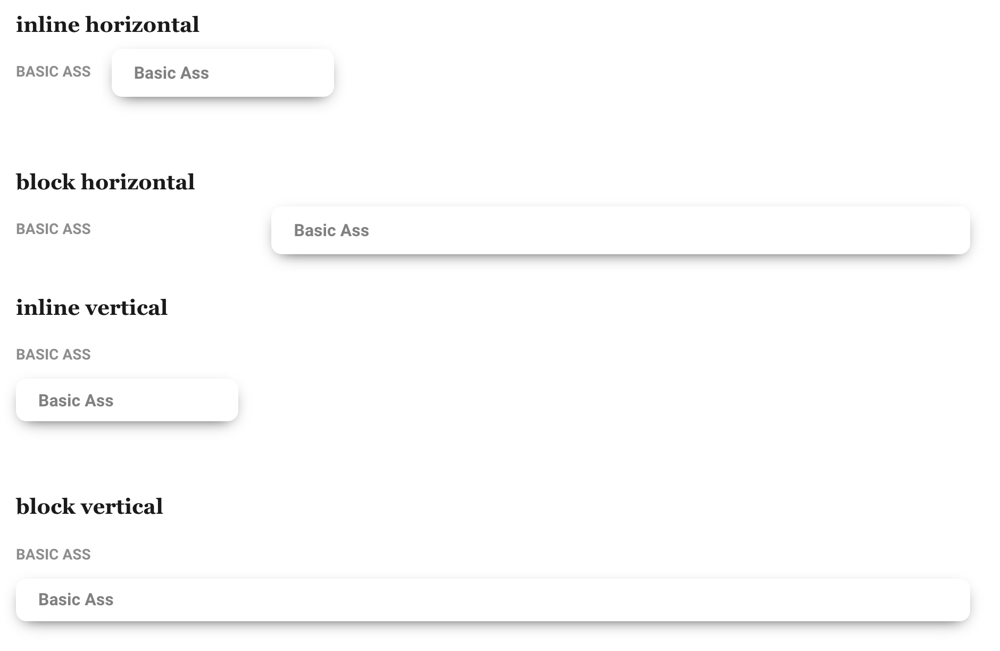

# Form and input fields

Please `form`give me

More info on [form elements](https://www.w3schools.com/html/html_forms.asp)

## Form elements

Although styles are reset, To normalize or basically allow the framework to style them items as basic as a hoe add **`.input`** to your input bitch boy

```html
<input type="checkbox" class="input" />
```

### Support

<table>
  <thead>
    <tr>
      <th>Element</th>
      <th>do it support?</th>
    </tr>
  </thead>
  <tbody>
    <tr>
      <td><code>button</code></td>
      <td>a little bit, or just use <a href="../components/button.md"><code>.btn</code></a></td>
    </tr>
    <tr>
      <td><code>select</code></td>
      <td>yes</td>
    </tr>
    <tr>
      <td><code>textarea</code></td>
      <td>yes</td>
    </tr>
    <tr>
      <td><code>datalist</code></td>
      <td>no</td>
    </tr>
    <tr>
      <td><code>input</code></td>
      <td>yes, but depends</td>
    </tr>
  </tbody>
</table>

## Form element helpers

These are further classes to add to `.input` to style the boy better dpending on the type of input it is

### **`.input-single-line`**


This styles an input field as a field for single line input.... uuhhhhhh yea

```html
<input type="text" class="input input-single-line" />
```

#### Support

##### Non input tags

<table>
  <thead>
    <tr>
      <th>Element</th>
      <th>do it support?</th>
    </tr>
  </thead>
  <tbody>
    <tr>
      <td><code>button</code></td>
      <td>no</td>
    </tr>
    <tr>
      <td><code>select</code></td>
      <td>somewhat. just use <code>.input-select</code> instead</td>
    </tr>
    <tr>
      <td><code>textarea</code></td>
      <td>yeah or just use <code>.input-multiple-line</code></td>
    </tr>
    <tr>
      <td><code>datalist</code></td>
      <td>no</td>
    </tr>
  </tbody>
</table>

##### Input tags

<table>
  <thead>
    <tr>
      <th><code>input[type*]</code></th>
      <th>do it support?</th>
    </tr>
  </thead>
  <tbody>
    <tr>
      <td><code>submit</code>, <code>reset</code>,<code>button</code></td>
      <td>no</td>
    </tr>
    <tr>
      <td><code>checkbox</code></td>
      <td>no</td>
    </tr>
    <tr>
      <td><code>color</code></td>
      <td>sure</td>
    </tr>
    <tr>
      <td><code>date</code>, <code>datetime-local</code>, <code>month</code>, <code>time</code>, <code>week</code></td>
      <td>yes</td>
    </tr>
    <tr>
      <td><code>email</code></td>
      <td>yes</td>
    </tr>
    <tr>
      <td><code>file</code></td>
      <td>yes</td>
    </tr>
    <tr>
      <td><code>hidden</code></td>
      <td>IT&#39;S NO USE IT&#39;S HIDDEN</td>
    </tr>
    <tr>
      <td><code>image</code></td>
      <td>somewhat.. it depends... why would you do that?</td>
    </tr>
    <tr>
      <td><code>number</code></td>
      <td>yes</td>
    </tr>
    <tr>
      <td><code>password</code></td>
      <td>yes</td>
    </tr>
    <tr>
      <td><code>radio</code></td>
      <td>no</td>
    </tr>
    <tr>
      <td><code>range</code></td>
      <td>no</td>
    </tr>
    <tr>
      <td><code>search</code></td>
      <td>yes</td>
    </tr>
    <tr>
      <td><code>tel</code></td>
      <td>yes</td>
    </tr>
    <tr>
      <td><code>text</code></td>
      <td>yes, it was built for this bitch</td>
    </tr>
    <tr>
      <td><code>url</code></td>
      <td>yes</td>
    </tr>
    <tr>
      <td><code>list</code></td>
      <td>yes</td>
    </tr>
  </tbody>
</table>

### **`.input-select`**



For a dropdown looking singlie line fuck...

It styles it kinda like a `.input-single-line` but with a cute arrow :>

Adding `.input-select` to a `select[multiple].input` styles it like... it should, but nicely. basta

```html
<select class="input input-select" name="shits">
  <option value="1">Available option 1</option>
  <option value="2">Available option 2</option>
  <option value="3">Available option 3</option>
  <option value="4">Available option 4</option>
</select>

<select class="input input-select" name="other-shits" multiple>
  <option value="1">Available option 1</option>
  <option value="2">Available option 2</option>
  <option value="3">Available option 3</option>
  <option value="4">Available option 4</option>
</select>
```

#### Support

##### Non input tags

<table>
  <thead>
    <tr>
      <th>Element</th>
      <th>do it support?</th>
    </tr>
  </thead>
  <tbody>
    <tr>
      <td><code>button</code></td>
      <td>no</td>
    </tr>
    <tr>
      <td><code>select</code></td>
      <td>FUCK YES</td>
    </tr>
    <tr>
      <td><code>textarea</code></td>
      <td>no, why that doesn&#39;t even make sense</td>
    </tr>
    <tr>
      <td><code>datalist</code></td>
      <td>no wtf</td>
    </tr>
  </tbody>
</table>

##### Input tags

<table>
  <thead>
    <tr>
      <th><code>input[type*]</code></th>
      <th>do it support?</th>
    </tr>
  </thead>
  <tbody>
    <tr>
      <td><code>submit</code>, <code>reset</code>,<code>button</code></td>
      <td>NO</td>
    </tr>
    <tr>
      <td><code>checkbox</code></td>
      <td>no</td>
    </tr>
    <tr>
      <td><code>color</code></td>
      <td>no</td>
    </tr>
    <tr>
      <td><code>date</code>, <code>datetime-local</code>, <code>month</code>, <code>time</code>, <code>week</code></td>
      <td>sure i guess or u know use a <code>select</code> element</td>
    </tr>
    <tr>
      <td><code>email</code></td>
      <td>sure i guess or u know use a <code>select</code> element</td>
    </tr>
    <tr>
      <td><code>file</code></td>
      <td>sure i guess or u know use a <code>select</code> element</td>
    </tr>
    <tr>
      <td><code>hidden</code></td>
      <td>IT&#39;S NO USE IT&#39;S HIDDEN</td>
    </tr>
    <tr>
      <td><code>image</code></td>
      <td>somewhat.. it depends... why would you do that?</td>
    </tr>
    <tr>
      <td><code>number</code></td>
      <td>sure i guess or u know use a <code>select</code> element</td>
    </tr>
    <tr>
      <td><code>password</code></td>
      <td>sure i guess or u know use a <code>select</code> element</td>
    </tr>
    <tr>
      <td><code>radio</code></td>
      <td>no</td>
    </tr>
    <tr>
      <td><code>range</code></td>
      <td>no</td>
    </tr>
    <tr>
      <td><code>search</code></td>
      <td>sure i guess or u know use a <code>select</code> element</td>
    </tr>
    <tr>
      <td><code>tel</code></td>
      <td>sure i guess or u know use a <code>select</code> element</td>
    </tr>
    <tr>
      <td><code>text</code></td>
      <td>sure i guess or u know use a <code>select</code> element</td>
    </tr>
    <tr>
      <td><code>url</code></td>
      <td>sure i guess or u know use a <code>select</code> element</td>
    </tr>
    <tr>
      <td><code>list</code></td>
      <td>sure i guess or u know use a <code>select</code> element</td>
    </tr>
  </tbody>
</table>

### **`.input-multiple-line`**


This styles an input field as a field for multiple line input.... uuhhhhhh yea

```html
<textarea class="input input-multiple-line" name="message" rows="10" cols="30">
The cat was playing in the garden.</textarea
>
```

#### Support

##### Non input tags

<table>
  <thead>
    <tr>
      <th>Element</th>
      <th>do it support?</th>
    </tr>
  </thead>
  <tbody>
    <tr>
      <td><code>button</code></td>
      <td>no</td>
    </tr>
    <tr>
      <td><code>select</code></td>
      <td>no</td>
    </tr>
    <tr>
      <td><code>textarea</code></td>
      <td>YAS BITCH</td>
    </tr>
    <tr>
      <td><code>datalist</code></td>
      <td>no</td>
    </tr>
  </tbody>
</table>

##### Input tags

<table>
  <thead>
    <tr>
    <th><code>input[type*]</code></th>
    <th>do it support?</th>
    </tr>
  </thead>
  <tbody>
    <tr>
      <td><code>submit</code>, <code>reset</code>,<code>button</code></td>
      <td>NO</td>
    </tr>
    <tr>
      <td><code>checkbox</code></td>
      <td>no</td>
    </tr>
    <tr>
      <td><code>color</code></td>
      <td>no</td>
    </tr>
    <tr>
      <td><code>date</code>, <code>datetime-local</code>, <code>month</code>, <code>time</code>, <code>week</code></td>
      <td>no</td>
    </tr>
    <tr>
      <td><code>email</code></td>
      <td>no</td>
    </tr>
    <tr>
      <td><code>file</code></td>
      <td>no</td>
    </tr>
    <tr>
      <td><code>hidden</code></td>
      <td>IT&#39;S NO USE IT&#39;S HIDDEN</td>
    </tr>
    <tr>
      <td><code>image</code></td>
      <td>no</td>
    </tr>
    <tr>
      <td><code>number</code></td>
      <td>no</td>
    </tr>
    <tr>
      <td><code>password</code></td>
      <td>no</td>
    </tr>
    <tr>
      <td><code>radio</code></td>
      <td>no</td>
    </tr>
    <tr>
      <td><code>range</code></td>
      <td>no</td>
    </tr>
    <tr>
      <td><code>search</code></td>
      <td>no</td>
    </tr>
    <tr>
      <td><code>tel</code></td>
      <td>no</td>
    </tr>
    <tr>
      <td><code>text</code></td>
      <td>uh no, use a <code>textarea</code> element instead</td>
    </tr>
    <tr>
      <td><code>url</code></td>
      <td>no</td>
    </tr>
    <tr>
      <td><code>list</code></td>
      <td>yes.. jk NO</td>
    </tr>
  </tbody>
</table>

### **`.input-inline`**

For inline shit or fields that dont necessarily accept text looking input like radio, checkbox, sliders and stuff

#### Support

##### Non input tags

<table>
  <thead>
    <tr>
      <th>Element</th>
      <th>do it support?</th>
    </tr>
  </thead>
  <tbody>
    <tr>
      <td><code>button</code></td>
      <td>yes, or just use <a href="../components/button.md"><code>.btn</code></a></td>
    </tr>
    <tr>
      <td><code>select</code></td>
      <td>yes</td>
    </tr>
    <tr>
      <td><code>textarea</code></td>
      <td>yes, but would you want to?</td>
    </tr>
    <tr>
      <td><code>datalist</code></td>
      <td>no</td>
    </tr>
  </tbody>
</table>

##### Input tags

<table>
  <thead>
    <tr>
      <th><code>input[type*]</code></th>
      <th>do it support?</th>
    </tr>
  </thead>
  <tbody>
    <tr>
      <td><code>submit</code>, <code>reset</code>,<code>button</code></td>
      <td>yes, or just use <a href="../components/button.md"><code>.btn</code></a></td>
    </tr>
    <tr>
      <td><code>checkbox</code></td>
      <td>yes</td>
    </tr>
    <tr>
      <td><code>color</code></td>
      <td>yes on chrome and firefox but not everywhere else</td>
    </tr>
    <tr>
      <td><code>date</code>, <code>datetime-local</code>, <code>month</code>, <code>time</code>, <code>week</code></td>
      <td>if you want it ugly-ish, sure</td>
    </tr>
    <tr>
      <td><code>email</code></td>
      <td>if you want it ugly-ish, sure</td>
    </tr>
    <tr>
      <td><code>file</code></td>
      <td>if you want it ugly-ish, sure</td>
    </tr>
    <tr>
      <td><code>hidden</code></td>
      <td>IT&#39;S NO USE IT&#39;S HIDDEN</td>
    </tr>
    <tr>
      <td><code>image</code></td>
      <td>yis</td>
    </tr>
    <tr>
      <td><code>number</code></td>
      <td>if you want it ugly-ish, sure</td>
    </tr>
    <tr>
      <td><code>password</code></td>
      <td>if you want it ugly-ish, sure</td>
    </tr>
    <tr>
      <td><code>radio</code></td>
      <td>yes</td>
    </tr>
    <tr>
      <td><code>range</code></td>
      <td>yes</td>
    </tr>
    <tr>
      <td><code>search</code></td>
      <td>if you want it ugly-ish, sure</td>
    </tr>
    <tr>
      <td><code>tel</code></td>
      <td>if you want it ugly-ish, sure</td>
    </tr>
    <tr>
      <td><code>text</code></td>
      <td>if you want it ugly-ish, sure</td>
    </tr>
    <tr>
      <td><code>url</code></td>
      <td>if you want it ugly-ish, sure</td>
    </tr>
    <tr>
      <td><code>list</code></td>
      <td>no</td>
    </tr>
  </tbody>
</table>

<!--
#### **`.input-round`**

Makes the edges of your stylized `.input` or `.input group` half circle round.

```html
<button type="button" class="btn btn-round btn-default">
	my edges are round like the fuCKING EARTH
</button>
``` -->

### Input templates

```html
<!-- Bitches that can be setup -->
<input class="input input-inline" type="button" name="" />

<input class="input input-inline" type="checkbox" name="" />

<input class="input input-single-line" type="color" name="" />

<input class="input input-calendar" type="date" name="" />

<input class="input input-single-line" type="datetime-local" name="" />

<input class="input input-single-line" type="email" name="" />

<input class="input input-single-line" type="file" name="" />

<input class="input input-single-line" type="hidden" name="" />

<input class="input input-inline" type="image" data-src="" name="" />

<input class="input input-single-line" type="month" name="" />

<input class="input input-single-line" type="number" name="" />

<input class="input input-single-line" type="password" name="" />

<input class="input input-inline" type="radio" name="" />

<input class="input input-inline" type="range" name="" />

<input class="input input-inline" type="reset" name="" />

<input class="input input-single-line" type="search" name="" />

<input class="input input-inline" type="submit" name="" />

<input class="input input-single-line" type="tel" name="" />

<input class="input input-single-line" type="text" name="" />

<input class="input input-single-line" type="time" name="" />

<input class="input input-single-line" type="url" name="" />

<input class="input input-single-line" type="week" name="" />

<input class="input input-single-line" list="" name="" />
<datalist>
  <option value=""></option>
</datalist>

<select class="input input-select" name="">
  <option value=""></option>
</select>

<select class="input input-select" multiple name="">
  <option value=""></option>
</select>

<textarea class="input input-multiple-line" name="" rows="" cols=""> </textarea>
```

# **`.input-label`**

To style a label, add class of `.input-label`

```html
<label class="input-label" for="bitch">Basic Ass</label>
<input
  class="input input-single-line"
  id="bitch"
  name="bitch"
  placeholder="Basic Ass"
  type="text"
/>
```

# **`.input-info`**

Add helper text along the field to help out the user `.input-info`


```html
<label class="input-label" for="message">Textarea + vertical wrapper</label>
<textarea
  placeholder="git wrecked"
  class="input input-multiple-line"
  id="message"
></textarea>
<span class="input-info"
  >A longer block of help text that breaks onto a new line and may extend beyond one
  line.</span
>
```

# **`.input-group`**

To group `.input` bois together

NOTE this only works best for `.input-single-line` and or `.input-select` fields

`.btn` elements will work innit as well

```html
<span class="input-group input-group-horizontal">
  <select class="input input-select">
    <option>Available option 1</option>
    <option>Available option 2</option>
    <option>Available option 3</option>
    <option>Available option 4</option>
    <option>Available option 5</option>
  </select>

  <select class="input input-select">
    <option>Available option 1</option>
    <option>Available option 2</option>
    <option>Available option 3</option>
    <option>Available option 4</option>
    <option>Available option 5</option>
  </select>

  <select class="input input-select">
    <option>Available option 1</option>
    <option>Available option 2</option>
    <option>Available option 3</option>
    <option>Available option 4</option>
    <option>Available option 5</option>
  </select>

  <select class="input input-single-line input-secondary">
    <option>Available option 1</option>
    <option>Available option 2</option>
    <option>Available option 3</option>
    <option>Available option 4</option>
    <option>Available option 5</option>
  </select>
</span>
```

## Basic examples

a `.btn-group` has to have either **`.input-group-horizontal`** or **`.input-group-vertical`** to make the group look nice

### Horizontal


```html
<span class="input-group input-group-horizontal">
  <select class="input input-select">
    <option>Available option 1</option>
    <option>Available option 2</option>
    <option>Available option 3</option>
    <option>Available option 4</option>
    <option>Available option 5</option>
  </select>

  <select class="input input-select">
    <option>Available option 1</option>
    <option>Available option 2</option>
    <option>Available option 3</option>
    <option>Available option 4</option>
    <option>Available option 5</option>
  </select>

  <select class="input input-select">
    <option>Available option 1</option>
    <option>Available option 2</option>
    <option>Available option 3</option>
    <option>Available option 4</option>
    <option>Available option 5</option>
  </select>

  <select class="input input-select">
    <option>Available option 1</option>
    <option>Available option 2</option>
    <option>Available option 3</option>
    <option>Available option 4</option>
    <option>Available option 5</option>
  </select>
</span>
```

NOTE if there are too much inputs, there will be a scrollbar on the button group container to allow access to those but butts


### Vertical

```html
<span class="input-group input-group-vertical">
  <select class="input input-select">
    <option>Available option 1</option>
    <option>Available option 2</option>
    <option>Available option 3</option>
    <option>Available option 4</option>
    <option>Available option 5</option>
  </select>

  <select class="input input-select">
    <option>Available option 1</option>
    <option>Available option 2</option>
    <option>Available option 3</option>
    <option>Available option 4</option>
    <option>Available option 5</option>
  </select>

  <select class="input input-select">
    <option>Available option 1</option>
    <option>Available option 2</option>
    <option>Available option 3</option>
    <option>Available option 4</option>
    <option>Available option 5</option>
  </select>

  <select class="input input-select">
    <option>Available option 1</option>
    <option>Available option 2</option>
    <option>Available option 3</option>
    <option>Available option 4</option>
    <option>Available option 5</option>
  </select>
</span>
```


## Input group helpers

### **`.input-group-responsive`**

In case absolutely horizontal and vertical button groups look too ugly, use this to make vertical and horizontal groups vertically stack like blocks on [max mobile breakpoint](../scaffolding/breakpoint.md#mobile-split)

### **`.input-block`**

Keep input-group full width all the fucking time

### **`.input-block-mobile`**

Keep input-group full width only on mobile

# **`.input-wrapper`**

Use to layout an input label and input without doing so much css. These are inline-flex elementos.

I must have either **`.input-wrapper-horizontal`** or **`.input-wrapper-vertical`** to actually have a layout

To set the wrapper to a full width block, add **`.input-wrapper-block`**

```html
<h4>inline horizontal</h4>
<p class="input-wrapper input-wrapper-horizontal">
  <label class="input-label">Basic Ass</label>
  <input class="input input-single-line" placeholder="Basic Ass" type="text" />
</p>

<h4>block horizontal</h4>
<p class="input-wrapper input-wrapper-horizontal input-wrapper-block">
  <label class="input-label">Basic Ass</label>
  <input class="input input-single-line" placeholder="Basic Ass" type="text" />
</p>

<h4>inline vertical</h4>
<p class="input-wrapper input-wrapper-vertical">
  <label class="input-label">Basic Ass</label>
  <input class="input input-single-line" placeholder="Basic Ass" type="text" />
</p>
<h4>block vertical</h4>
<p class="input-wrapper input-wrapper-vertical input-wrapper-block">
  <label class="input-label">Basic Ass</label>
  <input class="input input-single-line" placeholder="Basic Ass" type="text" />
</p>
```



# Color Helpers

## Input colors

To add feedback color the `.input`, add `.input-[color-tag]`.
To add feedback color the `.input-label`, add `.input-[color-tag]`.
Adding the color class on `.input-group` or `.input-wrapper` styles both the `.input-label` and `.input` within it

- **`.input-primary`**
- **`.input-secondary`**
- **`.input-accent`**
- **`.input-neutral`**
- **`.input-error`**
- **`.input-caution`**
- **`.input-success`**

### Input color support

Fuck this shit bro whhyyy

## Non input tags

| Element    | Support it?                                            |
| ---------- | ------------------------------------------------------ |
| `button`   | no, JUST USE FUCKiNG [`.btn`](../components/button.md) |
| `select`   | yes                                                    |
| `textarea` | no                                                     |
| `datalist` | no                                                     |

## Input tags

| `input[type*]`                                    | Support it?                                                |
| ------------------------------------------------- | ---------------------------------------------------------- |
| `submit`, `reset`,`button`                        | i guess, but you can use [`.btn`](../components/button.md) |
| `checkbox`                                        | no                                                         |
| `color`                                           | yes                                                        |
| `date`, `datetime-local`, `month`, `time`, `week` | yes                                                        |
| `email`                                           | yes                                                        |
| `file`                                            | yes                                                        |
| `hidden`                                          | IT'S NO USE IT'S HIDDEN                                    |
| `image`                                           | yes                                                        |
| `number`                                          | yes                                                        |
| `password`                                        | yes                                                        |
| `radio`                                           | no                                                         |
| `range`                                           | no                                                         |
| `search`                                          | yes                                                        |
| `tel`                                             | yes                                                        |
| `text`                                            | yes                                                        |
| `url`                                             | yes                                                        |
| `list`                                            | yes                                                        |

## Size

### **`.input-large`** and **`.input-small`**

Change em size. can be attached to `.input`, `.input-group`, `.input-label`, and `.input-wrapper`


### Non input tags

| Element    | Support it? |
| ---------- | ----------- |
| `button`   | no          |
| `select`   | no          |
| `textarea` | no          |
| `datalist` | no          |

### Input tags

| `input[type*]`                                    | Support it?                                                |
| ------------------------------------------------- | ---------------------------------------------------------- |
| `submit`, `reset`,`button`                        | i guess, but you can use [`.btn`](../components/button.md) |
| `checkbox`                                        | no                                                         |
| `color`                                           | no but kinda on safari                                     |
| `date`, `datetime-local`, `month`, `time`, `week` | yes                                                        |
| `email`                                           | yes                                                        |
| `file`                                            | yes                                                        |
| `hidden`                                          | IT'S NO USE IT'S HIDDEN                                    |
| `image`                                           | yes                                                        |
| `number`                                          | yes                                                        |
| `password`                                        | yes                                                        |
| `radio`                                           | no                                                         |
| `range`                                           | no                                                         |
| `search`                                          | yes                                                        |
| `tel`                                             | yes                                                        |
| `text`                                            | yes                                                        |
| `url`                                             | yes                                                        |
| `list`                                            | yes                                                        |

# Custom framework fields

## Toggle

true false input except... pure css and fancy

This works on either a `checkbox` or `radio`

```html
<div class="input-toggle p">
  <input type="checkbox" class="input" />
  <span class="input-label input-toggle-label">
    Test this fucker. do not use horizontal and vertical input classes with this shit or
    you dIE
  </span>
</div>

<div class="input-toggle p input-small">
  <input type="checkbox" class="input" />
  <span class="input-label input-toggle-label">
    Test this fucker. do not use horizontal and vertical input classes with this shit or
    you dIE
  </span>
</div>

<div class="input-toggle p input-large">
  <input type="checkbox" class="input" />
  <span class="input-label input-toggle-label">
    Test this fucker. do not use horizontal and vertical input classes with this shit or
    you dIE
  </span>
</div>

<div class="input-toggle p">
  <input type="checkbox" class="input" />
  <span class="input-label input-toggle-label input-primary">
    Test this fucker primary
  </span>
</div>

<div class="input-toggle p">
  <input type="checkbox" class="input" />
  <span class="input-label input-toggle-label input-secondary">
    Test this fucker secondary
  </span>
</div>

<div class="input-toggle p">
  <input type="checkbox" class="input" />
  <span class="input-label input-toggle-label input-accent">
    Test this fucker accent
  </span>
</div>

<div class="input-toggle p">
  <input type="checkbox" class="input" />
  <span class="input-label input-toggle-label input-success">
    Test this fucker success
  </span>
</div>

<div class="input-toggle p">
  <input type="checkbox" class="input" />
  <span class="input-label input-toggle-label input-caution">
    Test this fucker caution
  </span>
</div>

<div class="input-toggle p">
  <input type="checkbox" class="input" />
  <span class="input-label input-toggle-label input-error">
    Test this fucker error
  </span>
</div>

<div class="input-toggle p input-disabled">
  <input type="checkbox" class="input" />
  <span class="input-label input-toggle-label"> Test this fucker </span>
</div>

<div class="input-toggle p input-toggle-reverse">
  <input type="checkbox" class="input " />
  <span class="input-label input-toggle-label">
    Test this fucker this one should have toggle on the other side of the text
  </span>
</div>
```

you can put the toggle on the other side by adding `input-toggle-reverse` to `input-toggle`

Also it supports dem color tag bois


#### Non input tags

| Element    | do it support? |
| ---------- | -------------- |
| `button`   | no             |
| `select`   | no             |
| `textarea` | no             |
| `datalist` | no             |

### Support

| `input[type*]`                                    | Support it? |
| ------------------------------------------------- | ----------- |
| `submit`, `reset`,`button`                        | nope        |
| `checkbox`                                        | yesssss     |
| `color`                                           | no          |
| `date`, `datetime-local`, `month`, `time`, `week` | no          |
| `email`                                           | no          |
| `file`                                            | no          |
| `hidden`                                          | no          |
| `image`                                           | no          |
| `number`                                          | no          |
| `password`                                        | no          |
| `radio`                                           | yea         |
| `range`                                           | no          |
| `search`                                          | no          |
| `tel`                                             | no          |
| `text`                                            | yes         |
| `url`                                             | no          |
| `list`                                            | no          |

## Calendar

For date input except it fancy

It's an input where you have a date input type except it's fancier :')

To allow the framework to generate a UI for this, add a class of `input-calendar`
The generated UI will wrap the input field and also replicate the classes added to the input tag except `input-calendar` will now be `input-calendar-ui` to avoid clashing outfits and what not

```html
<input type="text" class="input input-calendar" value="2020-01-23" />
```


Once a value is set, the it will return an ISO8601 or `yyyy-mm-dd` formattted value into the `.input-calendar`

It will also render the date active in the calendar ui

This is also how to set a default value to the calendar as well

#### Non input tags

| Element    | do it support?           |
| ---------- | ------------------------ |
| `button`   | yes                      |
| `select`   | no                       |
| `textarea` | i guess??? but pls don't |
| `datalist` | no                       |

### Support

| `input[type*]`                                    | Support it?                                                    |
| ------------------------------------------------- | -------------------------------------------------------------- |
| `submit`, `reset`,`button`                        | no                                                             |
| `checkbox`                                        | no                                                             |
| `color`                                           | no                                                             |
| `date`, `datetime-local`, `month`, `time`, `week` | no. you either use the actual type or use something else :(((( |
| `email`                                           | no                                                             |
| `file`                                            | no                                                             |
| `hidden`                                          | yes                                                            |
| `image`                                           | no                                                             |
| `number`                                          | no                                                             |
| `password`                                        | no                                                             |
| `radio`                                           | no                                                             |
| `range`                                           | no                                                             |
| `search`                                          | no                                                             |
| `tel`                                             | no                                                             |
| `text`                                            | yes                                                            |
| `url`                                             | no                                                             |
| `list`                                            | no                                                             |

### Size

Like other reguler input fields, the UI also supports **`.input-large`** and **`.input-small`**

```html
<input type="text" class="input input-calendar input-large" />
<input type="text" class="input input-calendar input-small" />
```


### Colors

Also supports [input color helpers](#input-colors)

```html
<input type="text" class="input input-calendar input-primary" value="2020-01-05" />
<input type="text" class="input input-calendar input-secondary" value="2020-02-05" />
<input type="text" class="input input-calendar input-accent" value="2020-03-05" />
<input type="text" class="input input-calendar input-success" value="2020-04-05" />
<input type="text" class="input input-calendar input-caution" value="2020-05-05" />
<input type="text" class="input input-calendar input-error" value="2020-06-05" />
```


### Attributes/ Settings

Add these to customize ya boi further

**`data-calendar-start-day`** - `args.startDay`

Defaults to `0`

This is the index of the day the calendar starts. meaning...

```
0 = Sunday
1 = Monday
2 = Tuesday
3 = Wednesday
4 = Thursday
5 = Friday
6 = Saturday
```

**`data-calendar-min`** - `args.min`

Defaults to ``

Minimum date allowed. Must be in ISO8601 format.

**`data-calendar-max`** - `args.max`

Defaults to ``

Maximum date allowed. Must be in ISO8601 format.

**`data-calendar-year-span`** - `args.yearSpan`

Defaults to `0`

Number of additional year range the heading dropdown will output. Setting to 0 outputs only current year, 1 outputs 1 additional preceeding the year and 1 after the current year and then so on.

**`data-calendar-disabled-dates`** - `args.disabledDates`

Defaults to ``

Disables specific dates or keywords that must be separated with commas. Dates must be in ISO8601 format.

There also available keywords too

- `weekends` - disables weekends
- `past` - disables dates from before today's date
- `future` - disables dates from after today's date
- `yyyy-dd-mm` - a disabled date
- `yyyy-dd-mm,yyyy-dd-mm,yyyy-dd-mm...` - maraming disabled date

**`data-calendar-text-input`** - `args.textInput`

Defaults to `false`

Enables a text input field to input dates along with the calendar as well

**`data-calendar-month-skip`** - `args.monthSkip`

Defaults to `true`

Enable skipping through months

**`data-calendar-year-skip`** - `args.yearSkip`

Defaults to `false`

Enable skipping through years

### Javascript

#### Functions

##### **`fw.Form.Calendar(element,valueToRender,args)`**

Make a new boi by going `const formCalendar = new fw.Form.Calendar(element,valueToRender,args)`

`element` is the element itself. if blank, it does nothing

`valueToRender` is the value the input ui will use to base the render of the calendar. falls back to the `element.value`

`args` is the settings above available

```js
//defaults
{
	startDay:0,  //data-calendar-start-day
	min: null, //data-calendar-max
	max: null, //data-calendar-min
	yearSpan: 0, //data-calendar-year-span
	disabledDates: '',  //data-calendar-disabled-datese
	textInput: false, //data-calendar-text-input
	monthSkip: true, //data-calendar-month-skip
	yearSkip: false, //data-calendar-year-skip
}
```

##### **`formCalendar.update(newValue,valueToRender)`**

updates the values and renders the ui

`newValue` is the value for the input falls back to the `element.value`. setting it to an empty string removes the value while triggering change as if a user decided the input they put in it aint worth shit

`valueToRender` is the value the input ui will render. falls back to the `element.value`

##### **`formCalendar.validates(date,rangeOnly)`**

validates the value based on the instance's settings and overall stup of exiostence

`date` date to check

`rangeOnly` whether or not to check against disabled dates and weekends set by args

##### **`formCalendar.reset()`**

reset the input field or some shit but doesnt trigger change value because this is a programmatical solution is this the right way to describe it in english? idk basta kung kelangan mong walang nakalagay dito tapos kelangan ireset yung ui ito na to beh

##### **`formCalendar.init(element)`**

initializes ui

`element` is the element triggered. if left blank, this defaults to the element attached to the instance

##### **`fw.Form.Calendar.initAll()`**

initializes all uis

#### **`fw.Form.Calendar.configDefaults`**

returns obj with component arg defaults

#### **`fw.Form.Calendar.initListeners()`**

initializes all event listeners

#### **`formCalendar.args`**

returns obj with component set args

#### Events

- `click_fw_formCalendar` - happens on `triggerer`
- `keyup_fw_formCalendar` - happens on `triggerer`
- `change_fw_formCalendar` - happens on `triggerer`
- `before_init_fw_formCalendar` - happens on `document` before running functions to set up
- `init_fw_formCalendar` - happens on `document` when running functions to set up
- `after_init_fw_formCalendar` - happens on `document` after running functions to set up
- `before_render_fw_button` - happens on `element` before running functions to create the ui markup and modify the element
- `render_fw_formCalendar` - happens on `element` when running functions to create the ui markup and modify the element
- `after_render_fw_formCalendar` - happens on `element` after running functions to create the ui markup and modify the element

- `before_update_fw_button` - happens on `element` before running the update method
- `update_fw_formCalendar` - happens on `element` when running the update method
- `after_update_fw_formCalendar` - happens on `element` after running the update method

## Tags

Imagine inputting in a text field some tags separated by commas... but gucci :')

To allow the framework to generate a UI for this, add a class of `input-tags`
The generated UI will wrap the input field and also replicate the classes added to the input tag except `input-tags` will now be `input-tags-ui` to avoid clashing outfits and what not

```html
<input
  type="text"
  value="lil,stupid,ass,bitch,i,ain't,fuckin,with,u"
  class="input input-tags"
/>
```


Once a value is set, the values separated with commas will be separated as tags in the front end

### Support

| `input[type*]`                                    | Support it? |
| ------------------------------------------------- | ----------- |
| `submit`, `reset`,`button`                        | no          |
| `checkbox`                                        | no          |
| `color`                                           | no          |
| `date`, `datetime-local`, `month`, `time`, `week` | no          |
| `email`                                           | no          |
| `file`                                            | no          |
| `hidden`                                          | yes         |
| `image`                                           | no          |
| `number`                                          | no          |
| `password`                                        | no          |
| `radio`                                           | no          |
| `range`                                           | no          |
| `search`                                          | no          |
| `tel`                                             | no          |
| `text`                                            | yes         |
| `url`                                             | no          |
| `list`                                            | no          |

### Size

The UI also supports **`.input-large`** and **`.input-small`**

```html
<input
  type="text"
  value="lil,stupid,ass,bitch,i,ain't,fuckin,with,u"
  class="input input-tags"
/>
<input
  type="text"
  value="lil,stupid,ass,bitch,i,ain't,fuckin,with,u"
  class="input input-tags input-small"
/>
<input
  type="text"
  value="lil,stupid,ass,bitch,i,ain't,fuckin,with,u"
  class="input input-tags input-large"
/>
```


### Colors

Also supports [input color helpers](#input-colors)

```html
<input
  type="text"
  value="lil,stupid,ass,bitch,i,ain't,fuckin,with,u"
  class="input input-tags input-primary"
/>
<input
  type="text"
  value="lil,stupid,ass,bitch,i,ain't,fuckin,with,u"
  class="input input-tags input-secondary"
/>
<input
  type="text"
  value="lil,stupid,ass,bitch,i,ain't,fuckin,with,u"
  class="input input-tags input-accent"
/>
<input
  type="text"
  value="lil,stupid,ass,bitch,i,ain't,fuckin,with,u"
  class="input input-tags input-success"
/>
<input
  type="text"
  value="lil,stupid,ass,bitch,i,ain't,fuckin,with,u"
  class="input input-tags input-error"
/>
<input
  type="text"
  value="lil,stupid,ass,bitch,i,ain't,fuckin,with,u"
  class="input input-tags input-caution"
/>
<input
  type="text"
  value="lil,stupid,ass,bitch,i,ain't,fuckin,with,u"
  class="input input-tags input-disabled"
/>
```


### Attributes/Settings

Add these to customize ya boi further

**`data-tags-width`** - `args.width`

```html
<input
  type="text"
  value="lil,stupid,ass,bitch,i,ain't,fuckin,with,u"
  class="input input-tags"
  data-tags-width="69em"
/>
```

Defaults to `auto`

Set a width for the input field. Note that there is a set max-width on ya boi so this will shrink if its containing element becomes too small

**`data-tags-callback (DEPRECATED)`**

callback function for after rendering the ui and changing the value

DEPRECATED ... just add an event listener on `after_update__fw_formTags`

```html
<script>
  function doSomething() {
    alert('i did something');
  }
</script>
<input
  type="text"
  value="lil,stupid,ass,bitch,i,ain't,fuckin,with,u"
  class="input input-tags"
  data-tags-callback="doSomehing()"
/>
```

**`data-tags-filter` (previously data-tag-callback-name-filter or something like that)** - `args.filter`

name of the function to callback to manipulating and return the value before rendering of the input tags

```html
<script>
  function changeCurseWord(value) {
    //manipulate value
    value = value.replace('bitch', 'shitbag');

    //return value for render
    return value;
  }
</script>
<input
  type="text"
  value="lil,stupid,ass,bitch,i,ain't,fuckin,with,u"
  class="input input-tags"
  data-tags-filter="changeCurseWord"
/>
```

**`data-tags-on-keyup` (previously data-tag-callback-on-keyup or something like that)** - `args.onKeyUp`

callback function after keyup on the input field. NOTE. the field is actually a `span[contenteditable]`

```html
<input
  type="text"
  value="lil,stupid,ass,bitch,i,ain't,fuckin,with,u"
  class="input input-tags"
  data-tags-on-keyup="logSomeFuckers(e)"
/>
```

**`data-tags-multiple-lines`** - `args.multipleLines`

defaults to false

if enabled, allows floe of tags intoo multiple lines like a textarea

```html
<input
  type="text"
  value="lil,stupid,ass,bitch,i,ain't,fuckin,with,u"
  class="input input-tags"
  data-tags-multiple-lines="true"
/>
```

**`data-tags-multiple-lines-break`** - `args.multipleLinesBreak`

defaults to false

if enabled, makes the tags occupy their own block widths. only works if set to multiple

```html
<input
  type="text"
  value="lil,stupid,ass,bitch,i,ain't,fuckin,with,u"
  class="input input-tags"
  data-tags-multiple-lines="true"
  data-tags-multiple-lines-break="true"
/>
```

**`data-tags-max-char`** - `args.maxChar`

defaults to 0

if set to more than 0, component will be filtered to only accept tags that are at most that amount of characters

```html
<input
  type="text"
  value="lil,stupid,ass,bitch,i,ain't,fuckin,with,u"
  class="input input-tags"
  data-tags-max-char="5"
/>
<!-- 'stupid' will be removed since it's 6 characters and 6 is more than 5. duh  -->
```

**`data-tags-max-char-snip`** - `args.maxCharSnip`

defaults to false

if enabled, will cut the tags that are more than the set `args.maxChar` and replace the last character with the ellipsis character (&hellip;) to signify that yes, the tag was trimmed because there too much words. Has no effect if there is no set `args.maxChar`.

```html
<input
  type="text"
  value="lil,stupid,ass,bitch,i,ain't,fuckin,with,u"
  class="input input-tags"
  data-tags-max-char="5"
  data-tags-max-char-snip="true"
/>
<!-- 'stupid' will become 'stupi…'  -->
```

### Javascript

#### Functions

##### **`fw.Form.Tags(element,valueToRender,args)`**

Make a new boi by going `const formTags = new fw.Form.Tags(element,valueToRender,args)`

`element` is the element itself. if blank, it does nothing

`valueToRender` is the value the input ui will render. falls back to the `element.value`

`args` is the settings above available

```js
//defaults
{
	width: null, //data-tags-width
	callback: null, //data-tags-callback
	filter: null, //data-tags-filter
	onKeyUp: null, //data-tags-on-keyup
	multipleLines: false, //data-tags-multiple-lines
	multipleLinesBreak: false, //data-tags-multiple-lines-break
  maxChar: 0,
  maxCharSnip: false,
}
```

##### **`formTags.update(newValue,valueToRender,inputText)`**

updates the values and renders the ui

`newValue` is the value for the input falls back to the `element.value`

`valueToRender` is the value the input ui will render. falls back to the `element.value`

`inputText` is the contents of the input field


##### **`formTags.reset()`**

reset the input field or some shit but doesnt trigger change value because this is a programmatical solution is this the right way to describe it in english? idk basta kung kelangan mong walang nakalagay dito tapos kelangan ireset yung ui ito na to beh

##### **`formTags.focus(disableNative)`**

render ui as focused

`disableNative` is whether or not to enable the native method

##### **`formTags.blur(disableNative)`**

render ui as blurred

`disableNative` is whether or not to enable the native method

##### **`formTags.init(element)`**

initializes ui

`element` is the element triggered. if left blank, this defaults to the element attached to the instance

##### **`fw.Form.Tags.initAll()`**

initializes all uis

#### **`fw.Form.Tags.configDefaults`**

returns obj with component arg defaults

#### **`fw.Form.Tags.initListeners()`**

initializes all event listeners

#### **`formTags.args`**

returns obj with component set args

#### Events

- `click_fw_formTags` - happens on `triggerer`
- `keydown_fw_formTags` - happens on `triggerer`
- `blur_fw_formTags` - happens on `triggerer`
- `paste_fw_formTags` - happens on `triggerer`
- `change_fw_formTags` - happens on `triggerer`
- `before_init_fw_formTags` - happens on `document` before running functions to set up
- `init_fw_formTags` - happens on `document` when running functions to set up
- `after_init_fw_formTags` - happens on `document` after running functions to set up
- `before_render_fw_button` - happens on `element` before running functions to create the ui markup and modify the element
- `render_fw_formTags` - happens on `element` when running functions to create the ui markup and modify the element
- `after_render_fw_formTags` - happens on `element` after running functions to create the ui markup and modify the element

- `before_update_fw_button` - happens on `element` before running the update method
- `update_fw_formTags` - happens on `element` when running the update method
- `after_update_fw_formTags` - happens on `element` after running the update method

[Back to TOC](../../../readme.md)
