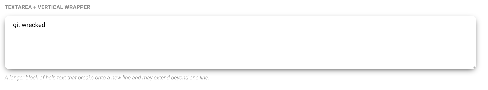

# Form and input fields

Please forgive me

## Form elements

Although styles are reset, To normalize or basically allow the framework to style them items add **`.input`** to your input bitch boy


```html
<input type="checkbox" class="input">
```

## Input helpers

### **`.input-single-line`**


This styles an input field as a field for single line input.... uuhhhhhh yea


### **`.input-multiple-line`**



This styles an input field as a field for multiple line input.... uuhhhhhh yea

### **`.input-inline`**

For inline shit or fields that dont necessarily accept text looking input like radio, checkbox, sliders and stuff


### Styling class support

Here's how the classes above support things

I tried my best, but I guess my best wasn't good enough

## Non input tags

| Element | `.input` | `.input-single-line` | `.input-multiple-line `| `.input-inline` |
| -- | -- | -- | -- | -- |
| `button` | no | NO | NOO | JUST USE FUCKiNG [`.btn`](../components/button.md) |
| `select` | no (if this is the only class present) | yes | yes( if [multiple] ) | no |
| `textarea` | no (if this is the only class present) | no | yes | no |
| `datalist` | no | no | no | no |


##  Input tags


| `input[type*]` 	| `.input` 	| `.input-single-line` 	| `.input-multiple-line `	| `.input-inline` 	|
| -- | -- | -- | -- | -- |
|`submit`, `reset`,`button` | no | NO | NOO | i guess, but you can use [`.btn`](../components/button.md) |
| `checkbox` | yes | no | no | yes |
| `color` | yes | no | no | yes |
| `date`, `datetime-local`, `month`, `time`, `week` | yes | yes | no | no |
| `email` | yes | yes | no | no |
| `file` | yes | yes | no | no |
| `hidden` | no | no | NO | IT'S NO USE IT'S HIDDEN |
| `image` | yes | yes | no | no |
| `number` | yes | yes | no | no |
| `password` | yes | yes | no | no |
| `radio` | yes | no | no | yes |
| `range` | yes | no | no | yes |
| `search` | yes | yes | no | no |
| `tel` | yes | yes | no | no |
| `text` | yes | yes | no | no |
| `url` | yes | yes | no | no |
| `list` | yes | yes | no | no |

```html
<!-- Bitches that can be setup -->
<input class="input input-inline" type="button" value="Bitch">
<input class="input input-inline" type="checkbox">
<input class="input input-inline" type="color">
<input class="input input-single-line" type="date">
<input class="input input-single-line" type="datetime-local">
<input class="input input-single-line" type="email">
<input class="input input-single-line" type="file">
<input class="input input-single-line" type="hidden">
<input class="input input-single-line" type="image">
<input class="input input-single-line" type="month">
<input class="input input-single-line" type="number">
<input class="input input-single-line" type="password">
<input class="input input-inline" type="radio">
<input class="input input-inline" type="range">
<input class="input input-inline" type="reset">
<input class="input input-single-line" type="search">
<input class="input input-inline" type="submit">
<input class="input input-single-line" type="tel">
<input class="input input-single-line" type="text">
<input class="input input-single-line" type="time">
<input class="input input-single-line" type="url">
<input class="input input-single-line" type="week">
<input class="input input-single-line" list="browsers">
<datalist class="input" id="browsers">
	<option value="Internet Explorer">
	</option><option value="Firefox">
	</option><option value="Chrome">
	</option><option value="Opera">
	</option><option value="Safari">
</option></datalist>

<select class="input input-single-line" name="cars">
<option value="volvo">Volvo</option>
<option value="saab">Saab</option>
<option value="fiat">Fiat</option>
<option value="audi">Audi</option>
</select>


<select class="input input-multiple-line" name="cars" multiple>
<option value="volvo">Volvo</option>
<option value="saab">Saab</option>
<option value="fiat">Fiat</option>
<option value="audi">Audi</option>
</select>

<textarea class="input input-multiple-line" name="message" rows="10" cols="30">The cat was playing in the garden.</textarea>
```

# **`.input-label`**

To style a label, add class of `.input-label`

```html
<label class="input-label" >Basic Ass</label>
<input class="input input-single-line" placeholder="Basic Ass" type="text">
```


# **`.input-group`**

To group `.input` bois together

NOTE this only works best for `.input-single-line` fields

`.btn` elements will work innit as well

```html
<span class="input-group input-group-horizontal">

	<select class="input input-single-line" >
		<option>Available option 1</option>
		<option>Available option 2</option>
		<option>Available option 3</option>
		<option>Available option 4</option>
		<option>Available option 5</option>
	</select>

	<select class="input input-single-line" >
		<option>Available option 1</option>
		<option>Available option 2</option>
		<option>Available option 3</option>
		<option>Available option 4</option>
		<option>Available option 5</option>
	</select>

	<select class="input input-single-line" >
		<option>Available option 1</option>
		<option>Available option 2</option>
		<option>Available option 3</option>
		<option>Available option 4</option>
		<option>Available option 5</option>
	</select>

	<select class="input input-single-line input-accent" >
		<option>Available option 1</option>
		<option>Available option 2</option>
		<option>Available option 3</option>
		<option>Available option 4</option>
		<option>Available option 5</option>
	</select>

</span>
```


## Basic examples

a `.btn-group` has to have either **`.input-group-horizontal`** or **`.input-group-vertical`** to make the group look nice

### Horizontal

```html

<span class="input-group input-group-horizontal">

	<select class="input input-single-line" >
		<option>Available option 1</option>
		<option>Available option 2</option>
		<option>Available option 3</option>
		<option>Available option 4</option>
		<option>Available option 5</option>
	</select>

	<select class="input input-single-line" >
		<option>Available option 1</option>
		<option>Available option 2</option>
		<option>Available option 3</option>
		<option>Available option 4</option>
		<option>Available option 5</option>
	</select>

	<select class="input input-single-line" >
		<option>Available option 1</option>
		<option>Available option 2</option>
		<option>Available option 3</option>
		<option>Available option 4</option>
		<option>Available option 5</option>
	</select>

	<select class="input input-single-line input-accent" >
		<option>Available option 1</option>
		<option>Available option 2</option>
		<option>Available option 3</option>
		<option>Available option 4</option>
		<option>Available option 5</option>
	</select>

</span>
```

NOTE if there are too much inputs, there will be a scrollbar on the button group container to allow access to those but butts


### Vertical
```html

<span class="input-group input-group-vertical">

	<select class="input input-single-line" >
		<option>Available option 1</option>
		<option>Available option 2</option>
		<option>Available option 3</option>
		<option>Available option 4</option>
		<option>Available option 5</option>
	</select>

	<select class="input input-single-line" >
		<option>Available option 1</option>
		<option>Available option 2</option>
		<option>Available option 3</option>
		<option>Available option 4</option>
		<option>Available option 5</option>
	</select>

	<select class="input input-single-line" >
		<option>Available option 1</option>
		<option>Available option 2</option>
		<option>Available option 3</option>
		<option>Available option 4</option>
		<option>Available option 5</option>
	</select>

	<select class="input input-single-line input-accent" >
		<option>Available option 1</option>
		<option>Available option 2</option>
		<option>Available option 3</option>
		<option>Available option 4</option>
		<option>Available option 5</option>
	</select>

</span>
```


## Input group helpers

### **`.input-group-responsive`**

In case absolutely horizontal and vertical button groups look too ugly, use this to make vertical and horizontal groups vertically stack like blocks on [max mobile breakpoint](../scaffolding/breakpoint.md#mobile-split)


### **`.input-group-block`**

Keep input-group full width all the fucking time


## Trumbowyg

See [Trumbowyg](../components/trumbowyg.md)


# **`.input-wrapper`**

]@TODO

# Helpers

## Input colors

To add feedback color the `.input`, add `.input-[color-tag]`.

*	**`.input-base`**
*	**`.input-primary`**
*	**`.input-accent`**
*	**`.input-neutral`**
*	**`.input-error`**
*	**`.input-caution`**
*	**`.input-success`**

## Label colors

To add feedback color the `.input-label`, add `.input-[color-tag]`.

*	**`.label-base`**
*	**`.label-primary`**
*	**`.label-accent`**
*	**`.label-neutral`**
*	**`.label-error`**
*	**`.label-caution`**
*	**`.label-success`**


## Input wrapper colors

Adding the color class on `.input-group` styles both the `.input-label` and `.input` within it

*	**`.input-wrapper-base`**
*	**`.input-wrapper-primary`**
*	**`.input-wrapper-accent`**
*	**`.input-wrapper-neutral`**
*	**`.input-wrapper-error`**
*	**`.input-wrapper-caution`**
*	**`.input-wrapper-success`**


## Size

[]@TODO


### Input color support

Fuck this shit bro whhyyy

## Non input tags

| Element | Support it? |
| -- | -- |
| `button` | no, JUST USE FUCKiNG [`.btn`](../components/button.md) |
| `select` | yes |
| `textarea` | no |
| `datalist` | no |


##  Input tags


| `input[type*]` | Support it? |
| -- | -- |
|`submit`, `reset`,`button` | i guess, but you can use [`.btn`](../components/button.md) |
| `checkbox` | no |
| `color` | yes |
| `date`, `datetime-local`, `month`, `time`, `week` | yes |
| `email` | yes |
| `file` | yes |
| `hidden` | IT'S NO USE IT'S HIDDEN |
| `image` | yes |
| `number` | yes |
| `password` | yes |
| `radio` | no |
| `range` | no |
| `search` | yes |
| `tel` | yes |
| `text` | yes |
| `url` | yes |
| `list` | yes |

This lays out input fields

[Back to TOC](../../../readme.md)