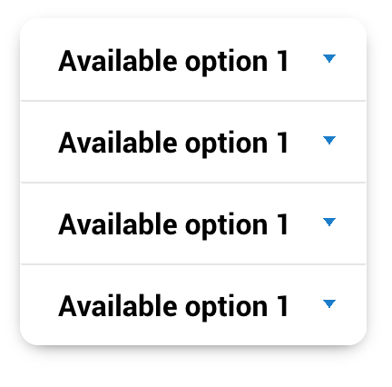

# Form and input fields

Please `form`give me

More info on [form elements](https://www.w3schools.com/html/html_forms.asp)

## Form elements

Although styles are reset, To normalize or basically allow the framework to style them items add **`.input`** to your input bitch boy


```html
<input type="checkbox" class="input">
```


### Support

| Element | do it support? |
| -- | -- |
| `button` | a little bit, or just use [`.btn`](../components/button.md) |
| `select` | yes |
| `textarea` | yes |
| `datalist` | no |
| `input` | yes, but depends |

## Form element helpers

These are further classes to add to `.input` to style the boy better dpending on the type of input it is


### **`.input-single-line`**


This styles an input field as a field for single line input.... uuhhhhhh yea

```html
<input type="checkbox" class="input">
```

#### Support

##### Non input tags

| Element | do it support? |
| -- | -- |
| `button` | no |
| `select` | somewhat. just use `.input-select` instead |
| `textarea` | yeah or just use `.input-multiple-line` |
| `datalist` | no |

#####  Input tags

| `input[type*]` 	| do it support? |
| -- | -- |
|`submit`, `reset`,`button` | no |
| `checkbox` | no |
| `color` | sure |
| `date`, `datetime-local`, `month`, `time`, `week` | yes |
| `email` | yes |
| `file` | yes |
| `hidden` | IT'S NO USE IT'S HIDDEN |
| `image` | somewhat.. it depends... why would you do that? |
| `number` | yes |
| `password` | yes |
| `radio` | no |
| `range` | no | no | yes |
| `search` | yes |
| `tel` | yes |
| `text` | yes, it was built for this bitch |
| `url` | yes |
| `list` | yes |


### **`.input-select`**


For a dropdown looking singlie line fuck...

It styles it kinda like a `.input-single-line` but with a cute arrow :>

Adding `.input-select` to a `select[multiple].input` styles it like... it should, but nicely. basta

```html
<select class="input input-select" name="shits">
	<option value="1">Available option 1</option>
	<option value="2">Available option 2</option>
	<option value="3">Available option 3</option>
	<option value="4">Available option 4</option>
</select>


<select class="input input-select" name="other-shits" multiple>
	<option value="1">Available option 1</option>
	<option value="2">Available option 2</option>
	<option value="3">Available option 3</option>
	<option value="4">Available option 4</option>
</select>
```

#### Support

##### Non input tags

| Element | do it support? |
| -- | -- |
| `button` | no |
| `select` | FUCK YES |
| `textarea` | no, why that doesn't even make sense |
| `datalist` | no wtf |

#####  Input tags

| `input[type*]` 	| do it support? |
| -- | -- |
|`submit`, `reset`,`button` | NO |
| `checkbox` | no |
| `color` | no |
| `date`, `datetime-local`, `month`, `time`, `week` | yes |
| `email` | yes |
| `file` | yes |
| `hidden` | IT'S NO USE IT'S HIDDEN |
| `image` | somewhat.. it depends... why would you do that? |
| `number` | yes |
| `password` | yes |
| `radio` | no |
| `range` | no |
| `search` | yes |
| `tel` | yes |
| `text` | yes, it was built for this bitch |
| `url` | yes |
| `list` | yes |


### **`.input-multiple-line`**


This styles an input field as a field for multiple line input.... uuhhhhhh yea

```html
<textarea class="input input-multiple-line" name="message" rows="10" cols="30">The cat was playing in the garden.</textarea>
```

#### Support

##### Non input tags

| Element | do it support? |
| -- | -- |
| `button` | no |
| `select` | no |
| `textarea` | YAS BITCH |
| `datalist` | no |

#####  Input tags

| `input[type*]` 	| do it support? |
| -- | -- |
|`submit`, `reset`,`button` | NO |
| `checkbox` | no |
| `color` | no |
| `date`, `datetime-local`, `month`, `time`, `week` | no |
| `email` | no |
| `file` | no |
| `hidden` | IT'S NO USE IT'S HIDDEN |
| `image` | no |
| `number` | no |
| `password` | no |
| `radio` | no |
| `range` | no |
| `search` | no |
| `tel` | no |
| `text` | uh no, use a `textarea` element instead |
| `url` | no |
| `list` | yes.. jk NO |


### **`.input-inline`**

For inline shit or fields that dont necessarily accept text looking input like radio, checkbox, sliders and stuff


#### Support

##### Non input tags

| Element | do it support? |
| -- | -- |
| `button` | yes, or just use [`.btn`](../components/button.md) |
| `select` | yes |
| `textarea` | yes, but would you want to? |
| `datalist` | no |

#####  Input tags

| `input[type*]` 	| do it support? |
| -- | -- |
|`submit`, `reset`,`button` |  yes, or just use [`.btn`](../components/button.md) |
| `checkbox` | yes |
| `color` | yes on chrome and firefox but not everywhere else |
| `date`, `datetime-local`, `month`, `time`, `week` | if you want it ugly-ish, sure |
| `email` | if you want it ugly-ish, sure |
| `file` | if you want it ugly-ish, sure |
| `hidden` | IT'S NO USE IT'S HIDDEN |
| `image` | yis |
| `number` | if you want it ugly-ish, sure |
| `password` | if you want it ugly-ish, sure |
| `radio` | yes |
| `range` | yes |
| `search` | if you want it ugly-ish, sure |
| `tel` | if you want it ugly-ish, sure |
| `text` | if you want it ugly-ish, sure |
| `url` | if you want it ugly-ish, sure |
| `list` | no |

### Custom UI

#### **`.input-calendar`**

For date input except it fancy


##### Support

###### Non input tags

| Element | do it support? |
| -- | -- |
| `button` | yes |
| `select` | no |
| `textarea` | i guess??? but pls don't |
| `datalist` | no |

######  Input tags

| `input[type*]` 	| do it support? |
| -- | -- |
|`submit`, `reset`,`button` |  NOPE |
| `checkbox` | no |
| `color` | no |
| `date`, `datetime-local`, `month`, `time`, `week` | if you want it ugly-ish, sure |
| `email` | if you want it ugly-ish, sure |
| `file` | if you want it ugly-ish, sure |
| `hidden` | IT'S NO USE IT'S HIDDEN |
| `image` | yis |
| `number` | if you want it ugly-ish, sure |
| `password` | if you want it ugly-ish, sure |
| `radio` | yes |
| `range` | yes |
| `search` | if you want it ugly-ish, sure |
| `tel` | if you want it ugly-ish, sure |
| `text` | if you want it ugly-ish, sure |
| `url` | if you want it ugly-ish, sure |
| `list` | no |


### Input templates

```html
<!-- Bitches that can be setup -->
<input class="input input-inline" type="button" name="">

<input class="input input-inline" type="checkbox" name="">

<input class="input input-single-line" type="color" name="">

<input class="input input-calendar" type="date" name="">

<input class="input input-single-line" type="datetime-local" name="">

<input class="input input-single-line" type="email" name="">

<input class="input input-single-line" type="file" name="">

<input class="input input-single-line" type="hidden" name="">

<input class="input input-inline" type="image" data-src="" name="">

<input class="input input-single-line" type="month" name="">

<input class="input input-single-line" type="number" name="">

<input class="input input-single-line" type="password" name="">

<input class="input input-inline" type="radio" name="">

<input class="input input-inline" type="range" name="">

<input class="input input-inline" type="reset" name="">

<input class="input input-single-line" type="search" name="">

<input class="input input-inline" type="submit" name="">

<input class="input input-single-line" type="tel" name="">

<input class="input input-single-line" type="text" name="">

<input class="input input-single-line" type="time" name="">

<input class="input input-single-line" type="url" name="">

<input class="input input-single-line" type="week" name="">

<input class="input input-single-line" list="" name="">
<datalist>
	<option value="">
</option></datalist>

<select class="input input-select" name="">
	<option value=""></option>
</select>

<select class="input input-select" multiple name="">
	<option value=""></option>
</select>

<textarea class="input input-multiple-line" name="" rows="" cols="">	
</textarea>
```

# **`.input-label`**

To style a label, add class of `.input-label`

```html
<label class="input-label" for="bitch" >Basic Ass</label>
<input class="input input-single-line" id="bitch" name="bitch" placeholder="Basic Ass" type="text">
```

# **`.input-info`**

Add helper text along the field to help out the user `.input-info`


```html
<label class="input-label" for="message">Textarea + vertical wrapper</label>						
<textarea placeholder="git wrecked" class="input input-multiple-line" id="message"></textarea>
<span class="input-info">A longer block of help text that breaks onto a new line and may extend beyond one line.</span>
```

# **`.input-group`**

To group `.input` bois together

NOTE this only works best for `.input-single-line` and or `.input-select` fields

`.btn` elements will work innit as well

```html
<span class="input-group input-group-horizontal">

	<select class="input input-select" >
		<option>Available option 1</option>
		<option>Available option 2</option>
		<option>Available option 3</option>
		<option>Available option 4</option>
		<option>Available option 5</option>
	</select>

	<select class="input input-select" >
		<option>Available option 1</option>
		<option>Available option 2</option>
		<option>Available option 3</option>
		<option>Available option 4</option>
		<option>Available option 5</option>
	</select>

	<select class="input input-select" >
		<option>Available option 1</option>
		<option>Available option 2</option>
		<option>Available option 3</option>
		<option>Available option 4</option>
		<option>Available option 5</option>
	</select>

	<select class="input input-single-line input-secondary" >
		<option>Available option 1</option>
		<option>Available option 2</option>
		<option>Available option 3</option>
		<option>Available option 4</option>
		<option>Available option 5</option>
	</select>

</span>
```


## Basic examples

a `.btn-group` has to have either **`.input-group-horizontal`** or **`.input-group-vertical`** to make the group look nice

### Horizontal


```html
<span class="input-group input-group-horizontal">

	<select class="input input-select" >
		<option>Available option 1</option>
		<option>Available option 2</option>
		<option>Available option 3</option>
		<option>Available option 4</option>
		<option>Available option 5</option>
	</select>

	<select class="input input-select" >
		<option>Available option 1</option>
		<option>Available option 2</option>
		<option>Available option 3</option>
		<option>Available option 4</option>
		<option>Available option 5</option>
	</select>

	<select class="input input-select" >
		<option>Available option 1</option>
		<option>Available option 2</option>
		<option>Available option 3</option>
		<option>Available option 4</option>
		<option>Available option 5</option>
	</select>

	<select class="input input-select" >
		<option>Available option 1</option>
		<option>Available option 2</option>
		<option>Available option 3</option>
		<option>Available option 4</option>
		<option>Available option 5</option>
	</select>

</span>
```

NOTE if there are too much inputs, there will be a scrollbar on the button group container to allow access to those but butts


### Vertical
```html

<span class="input-group input-group-vertical">

	<select class="input input-select" >
		<option>Available option 1</option>
		<option>Available option 2</option>
		<option>Available option 3</option>
		<option>Available option 4</option>
		<option>Available option 5</option>
	</select>

	<select class="input input-select" >
		<option>Available option 1</option>
		<option>Available option 2</option>
		<option>Available option 3</option>
		<option>Available option 4</option>
		<option>Available option 5</option>
	</select>

	<select class="input input-select" >
		<option>Available option 1</option>
		<option>Available option 2</option>
		<option>Available option 3</option>
		<option>Available option 4</option>
		<option>Available option 5</option>
	</select>

	<select class="input input-select" >
		<option>Available option 1</option>
		<option>Available option 2</option>
		<option>Available option 3</option>
		<option>Available option 4</option>
		<option>Available option 5</option>
	</select>

</span>
```



## Input group helpers

### **`.input-group-responsive`**

In case absolutely horizontal and vertical button groups look too ugly, use this to make vertical and horizontal groups vertically stack like blocks on [max mobile breakpoint](../scaffolding/breakpoint.md#mobile-split)


### **`.input-group-block`**

Keep input-group full width all the fucking time


### **`.input-group-block-mobile`**

Keep input-group full width only on mobile


## Trumbowyg

See [Trumbowyg](../components/trumbowyg.md)


# **`.input-wrapper`**

Use to layout an input label and input without doing so much css. These are inline-flex elementos. 

I must have either  **`.input-wrapper-horizontal`** or **`.input-wrapper-vertical`** to actually have a layout

To set the wrapper to a full width block, add **`.input-wrapper-block`**

```html
<h4>inline horizontal</h4>
<p class="input-wrapper input-wrapper-horizontal">
	<label class="input-label" >Basic Ass</label>
	<input class="input input-single-line" placeholder="Basic Ass" type="text">
</p>

<h4>block horizontal</h4>
<p class="input-wrapper input-wrapper-horizontal input-wrapper-block">
	<label class="input-label" >Basic Ass</label>
	<input class="input input-single-line" placeholder="Basic Ass" type="text">
</p>

<h4>inline vertical</h4>
<p class="input-wrapper input-wrapper-vertical">
	<label class="input-label" >Basic Ass</label>
	<input class="input input-single-line" placeholder="Basic Ass" type="text">
</p>
<h4>block vertical</h4>
<p class="input-wrapper input-wrapper-vertical input-wrapper-block">
	<label class="input-label" >Basic Ass</label>
	<input class="input input-single-line" placeholder="Basic Ass" type="text">
</p>
```


# Color Helpers

## Input colors

To add feedback color the `.input`, add `.input-[color-tag]`.
To add feedback color the `.input-label`, add `.input-[color-tag]`.
Adding the color class on `.input-group` or `.input-wrapper` styles both the `.input-label` and `.input` within it

*	**`.input-primary`**
*	**`.input-secondary`**
*	**`.input-accent`**
*	**`.input-neutral`**
*	**`.input-error`**
*	**`.input-caution`**
*	**`.input-success`**

### Input color support

Fuck this shit bro whhyyy

## Non input tags

| Element | Support it? |
| -- | -- |
| `button` | no, JUST USE FUCKiNG [`.btn`](../components/button.md) |
| `select` | yes |
| `textarea` | no |
| `datalist` | no |


##  Input tags


| `input[type*]` | Support it? |
| -- | -- |
|`submit`, `reset`,`button` | i guess, but you can use [`.btn`](../components/button.md) |
| `checkbox` | no |
| `color` | yes |
| `date`, `datetime-local`, `month`, `time`, `week` | yes |
| `email` | yes |
| `file` | yes |
| `hidden` | IT'S NO USE IT'S HIDDEN |
| `image` | yes |
| `number` | yes |
| `password` | yes |
| `radio` | no |
| `range` | no |
| `search` | yes |
| `tel` | yes |
| `text` | yes |
| `url` | yes |
| `list` | yes |


## Size

### **`.input-large`** and  **`.input-small`**

Change em size. can be attached to `.input`, `.input-group`, `.input-label`, and `.input-wrapper`


### Non input tags

| Element | Support it? |
| -- | -- |
| `button` | no |
| `select` | no |
| `textarea` | no |
| `datalist` | no |


###  Input tags


| `input[type*]` | Support it? |
| -- | -- |
|`submit`, `reset`,`button` | i guess, but you can use [`.btn`](../components/button.md) |
| `checkbox` | no |
| `color` | no but kinda on safari |
| `date`, `datetime-local`, `month`, `time`, `week` | yes |
| `email` | yes |
| `file` | yes |
| `hidden` | IT'S NO USE IT'S HIDDEN |
| `image` | yes |
| `number` | yes |
| `password` | yes |
| `radio` | no |
| `range` | no |
| `search` | yes |
| `tel` | yes |
| `text` | yes |
| `url` | yes |
| `list` | yes |


#Custom framework fields

## Calendar


It's an input where you have a date input type except it's fancier :')

To allow the framework to generate a UI for this, add a class of `input-calendar`
The generated UI will wrap the input field and also replicate the classes added to the input tag except `input-calendar` will now be `input-calendar-ui` to avoid clashing outfits and what not

```html
<input type="text" class="input input-calendar" value="2020-01-23" />
```


Once a value is set, the it will return an ISO8601 or `yyyy-mm-dd` formattted value into the `.input-calendar`

It will also render the date active in the calendar ui

This is also how to set a default value to the calendar as well


### Support 
| `input[type*]` | Support it? |
| -- | -- |
|`submit`, `reset`,`button` | no |
| `checkbox` | no |
| `color` | no |
| `date`, `datetime-local`, `month`, `time`, `week` | no. you either use the actual type or use something else :(((( |
| `email` | no |
| `file` | no |
| `hidden` | yes |
| `image` | no |
| `number` | no |
| `password` | no |
| `radio` | no |
| `range` | no |
| `search` | no |
| `tel` | no |
| `text` | yes |
| `url` | no |
| `list` | no |


### Size

Like other reguler input fields, the UI also supports **`.input-large`** and  **`.input-small`**

```html
<input type="text" class="input input-calendar input-large">
<input type="text" class="input input-calendar input-small">
```


### Colors

Also supports [input color helpers](#input-colors)

```html
<input type="text" class="input input-calendar input-primary" value="2020-01-05" />
<input type="text" class="input input-calendar input-secondary" value="2020-02-05" />
<input type="text" class="input input-calendar input-accent" value="2020-03-05" />
<input type="text" class="input input-calendar input-success" value="2020-04-05" />
<input type="text" class="input input-calendar input-caution" value="2020-05-05" />
<input type="text" class="input input-calendar input-error" value="2020-06-05" />
```


### Attributes

Add these to customize ya boi further

**`data-calendar-start-day`**

Defaults to `0`

This is the index of the day the calendar starts. meaning...
```
0 = Sunday
1 = Monday
2 = Tuesday
3 = Wednesday
4 = Thursday
5 = Friday
6 = Saturday
```


**`data-calendar-max`**

Defaults to ``

Maximum date allowed. Must be in ISO8601 format.


**`data-calendar-min`**

Defaults to ``

Minimum date allowed. Must be in ISO8601 format.


**`data-calendar-dropdown-year-span`**

Defaults to `1`

Number of years the heading dropdown will output

**`data-calendar-disabled-dates`**

Defaults to ``

Disables specific dates or keywords that must be separated with commas. Dates must be in ISO8601 format.

There also available keywords too

*	`weekends` - disables weekends
*	`past` - disables dates from before today's date
*	`future` - disables dates from after today's date


**`data-calendar-text-input`**

Defaults to `false`

Enables a text input field to input dates along with the calendar as well


## Tags (Plugged bversion only for now)

Imagine inputting in a text field some tags separated by commas... but gucci :')

To allow the framework to generate a UI for this, add a class of `input-tags`
The generated UI will wrap the input field and also replicate the classes added to the input tag except `input-tags` will now be `input-tags-ui` to avoid clashing outfits and what not

```html
	<input type="text" value="lil,stupid,ass,bitch,i,ain't,fuckin,with,u" class="input input-tags" />
```


Once a value is set, the values separated with commas will be separated as tags in the front end


### Support 
| `input[type*]` | Support it? |
| -- | -- |
|`submit`, `reset`,`button` | no |
| `checkbox` | no |
| `color` | no |
| `date`, `datetime-local`, `month`, `time`, `week` | no |
| `email` | no |
| `file` | no |
| `hidden` | yes |
| `image` | no |
| `number` | no |
| `password` | no |
| `radio` | no |
| `range` | no |
| `search` | no |
| `tel` | no |
| `text` | yes |
| `url` | no |
| `list` | no |


### Size

The UI also supports **`.input-large`** and  **`.input-small`**

```html
<input type="text" value="lil,stupid,ass,bitch,i,ain't,fuckin,with,u" class="input input-tags" />
<input type="text" value="lil,stupid,ass,bitch,i,ain't,fuckin,with,u" class="input input-tags input-small" />
<input type="text" value="lil,stupid,ass,bitch,i,ain't,fuckin,with,u" class="input input-tags input-large" />
```


### Colors

Also supports [input color helpers](#input-colors)

```html
<input type="text" value="lil,stupid,ass,bitch,i,ain't,fuckin,with,u" class="input input-tags input-primary" />
<input type="text" value="lil,stupid,ass,bitch,i,ain't,fuckin,with,u" class="input input-tags input-secondary" />
<input type="text" value="lil,stupid,ass,bitch,i,ain't,fuckin,with,u" class="input input-tags input-accent" />
<input type="text" value="lil,stupid,ass,bitch,i,ain't,fuckin,with,u" class="input input-tags input-success" />
<input type="text" value="lil,stupid,ass,bitch,i,ain't,fuckin,with,u" class="input input-tags input-error" />
<input type="text" value="lil,stupid,ass,bitch,i,ain't,fuckin,with,u" class="input input-tags input-caution" />
<input type="text" value="lil,stupid,ass,bitch,i,ain't,fuckin,with,u" class="input input-tags input-disabled" />
```


### Attributes

Add these to customize ya boi further

**`data-tags-width`**

```html
<input type="text" value="lil,stupid,ass,bitch,i,ain't,fuckin,with,u" class="input input-tags" data-tags-width="69em" />
```

Defaults to `auto`

Set a width for the input field. Note that there is a set max-width on ya boi so this will shrink if its containing element becomes too small

**`data-tags-callback`**

callback function for after rendering the ui and changing the value

```html
<script>
	function doSomething(){
		alert('i did something');
	}
</script>
<input type="text" value="lil,stupid,ass,bitch,i,ain't,fuckin,with,u" class="input input-tags" data-tags-callback="doSomehing()" />
```


**`data-tags-callback-on-keyup`**

callback function after keyup on the input field. NOTE. the field is actually a `span[contenteditable]`


```html
<input type="text" value="lil,stupid,ass,bitch,i,ain't,fuckin,with,u" class="input input-tags" data-tags-callback-on-keyup="logSomeFuckers(e)" />
```


#### 

[Back to TOC](../../../readme.md)