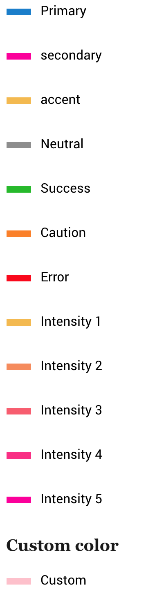

# Legends

This is to display graph color legends or whatever has colors and needs some legends.. :)

```html
<span class="legend legend-primary"></span> Primary 
```



## Colors

To color the legends, add `.legend-[color-tag]`

*	**`.legend-primary`**
*	**`.legend-accent`**
*	**`.legend-neutral`**
*	**`.legend-error`**
*	**`.legend-caution`**
*	**`.legend-success`**
*	**`.legend-intensity-1`**
*	**`.legend-intensity-2`**
*	**`.legend-intensity-3`**
*	**`.legend-intensity-4`**
*	**`.legend-intensity-5`**

More info on [color tags](../scaffolding/colors.md#color-tags)

The color can be customized by adding a background-color property to the legend

```html
<span class="legend" style="background-color:pink;"></span> Primary 
```

[Back to TOC](../../../readme.md)