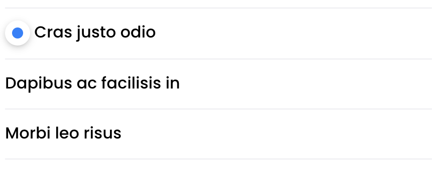

# List Group

It's a fancy list motherfucker





```html
<ul class="list-group">
	<li class="list-group-item">
		<span class="badge badge-primary"></span> Cras justo odio
	</li>
	<li class="list-group-item">
		Dapibus ac facilisis in
	</li>
	<li class="list-group-item">
		Morbi leo risus
	</li>
</ul>
```

To allow hover effects add `list-group-interactive` to `list-group` classes

To allow toggling, add `list-group-toggle` to `list-group` classes


#### **`.list-group-toggle`** helpers

#####  **`.list-group-toggle-multiple`**

Allows multiple active butt butts.

If you want one of the butts reset the active class, add the class **`.list-group-toggle-reset`** to it

If you want to allow the group to have no active bitches add  **`.list-group-toggle-allow-no-active`** to the group

```html

<ul class="list-group list-group-toggle list-group-toggle-multiple  list-group-toggle-allow-no-active ">
	<li class="list-group-item list-group-toggle-reset">
		All
	</li>
	<li class="list-group-item">
		<span class="badge badge-primary"></span> Cras justo odio
	</li>
	<li class="list-group-item">
		Dapibus ac facilisis in
	</li>
	<li class="list-group-item">
		Morbi leo risus
	</li>
</ul>
```


[Back to TOC](../../../readme.md)