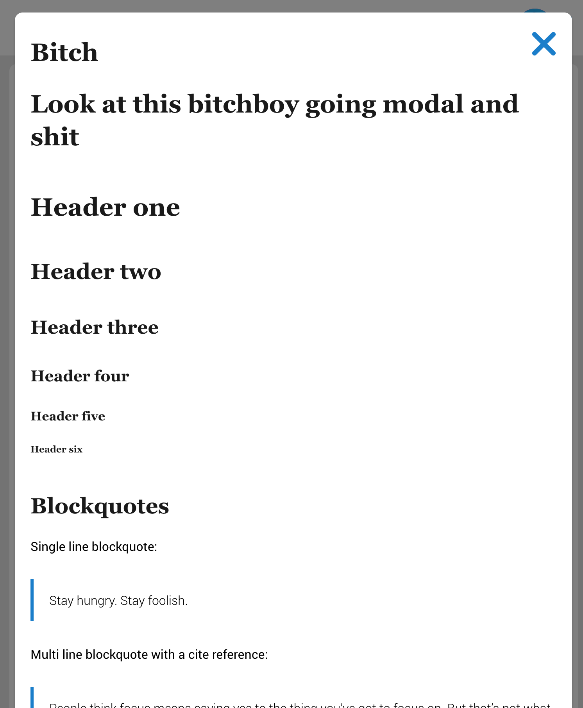

# Modal


This is how to setup a basic modal


```html
<a
	data-toggle="modal" href="#modal-demo">Modal Toggle</a>
<div class="modal" id="modal-demo">
	<!-- Put ya content here -->
</div>
```


## Toggler


### **`[data-toggle=modal]`**


Elements with this attribute looks for a `.modal` to append its content to an actual poppo

This one looks for the `href` of the boi
```html
<a href="#bitch-ass-modal" data-toggle="modal">Open a bitch</a>
<div id="bitch-ass-modal" class="modal">
	Sup mofos, I'm an modal content
</div>
```

Another way but [data-toggle="modal"] looks for a `data-href` to go to because there's no `href`

```html
<span data-href="#bitch-ass-modal" data-toggle="modal">Open a bitch</span>
<div id="bitch-ass-modal" class="modal">
	Sup mofos, I'm an modal content
</div>
```

Another way but [data-toggle="modal"] looks for a sibling because there's no `href` or `data-href`

```html
<div class="container">
	<span data-toggle="modal">Open a bitch</span>
	<div class="modal">
		Sup mofos, I'm an modal content
	</div>
</div>
```


## Toggle Attribuetes

### ****

### **`data-modal-title`**

Dafaults to `''`

Title to add a modal

### **`data-modal-close`**

Dafaults to `true`

Adds a close button to the modal

### **`data-modal-disable-overlay`**

Dafaults to `true'`

Whether or not to allow clicking on the overlay to close the modal

### **`data-modal-max-width`**

Dafaults to nothing

Whether or not to add a max-width to the modal

```html
<a
data-toggle="modal"
data-modal-close="false"
data-modal-disable-overlay="false"
data-modal-max-width="800px"
data-modal-title="Look at this bitchboy going modal and shit"
data-href="#modal-demo">Modal boi with max width and no close butt <i class="symbol symbol-search"></i></a>

<div class="modal" id="modal-demo">
	<!-- content heeeere -->
</div>
```




## Javascript

If a url's hash location matches an element with that id and it has an `modal` class, the modal will automatically open

to disable this write ya script


```js
(function(fw){
	frameWork.settings.initializeModal = false;
}(frameWork));
```

NOTE: this is useless if `frameWork.settings.dynamicHash` is set to `false`


[Back to TOC](../../../readme.md)