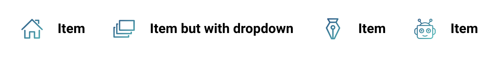

# Nav


I forgot how this works tbh

Here's a basic markup

```html
<div class="nav">
	<ul class="nav-list">
		<li class="nav-item">
			<a href="#">
				
				<span class="nav-item-text">Item</span>
			</a>
		</li>
		<li class="nav-item">
			<span data-toggle="dropdown">
				
				<span class="nav-item-text">Item but with dropdown</span>
				<ul class="dropdown" id="nav-demo-dropdown" >
					<li><a href="#">Drop item</a></li>
					<li><a href="#">Drop item</a></li>
					<li><a href="#">Drop item</a></li>
				</ul>
			</span>
		</li>
		<li class="nav-item">
			<a href="#">
				
				<span class="nav-item-text">Item</span>
			</a>
		</li>
		<li class="nav-item">
			<a href="#">
				
				<span class="nav-item-text">Item</span>
			</a>
		</li>
	</ul>
</div>
```





# **`.nav`**

container of the nav. On max [mobile maximum](../scaffolding/breakpoint.md#mobile-split), the nav items stack each other. `.input` and `.btn` instances within this will have custom vertical styles

## `.nav` helpers

### **`.nav-vertical`**

if a vertical layout is desired on all breakpoints, add a **`.nav-vertical`** to the block


```html
<div class="nav nav-vertical">
	
</div>
```

**`.nav-vertical`** works well with [accordion](../components/accordion.md) as well... probably... i mean it should

### **`.nav-sticky`**

This sticks the nav up top foREVER


# **`.nav-list`**

Menu list in the `.nav`

Adding `.nav-vertical` to `.nav` incluences the layout

Dropdowns have custom styles within this class as well


```html
<div class="nav">
	<ul class="nav-list">
		<!-- li items here -->
	</ul>
</div>
```


# **`.nav-item`**

Menu list item


```html
<div class="nav">
	<ul class="nav-list">
		<li class="nav-item">
		</li>
	</ul>
</div>
```


# **`.nav-icon`**

Icon you wanna use with a top level nav item. best with svgs


```html
<div class="nav">
	<ul class="nav-list">
		<li class="nav-item">
			
		</li>
	</ul>
</div>
```


# **`.nav-item-text`**

The text... in the item

```html
<div class="nav">
	<ul class="nav-list">
		<li class="nav-item">
			<a href="#">
				
				<span class="nav-item-text">Item</span>
			</a>
		</li>
	</ul>
</div>
```

[Back to TOC](../../../readme.md)