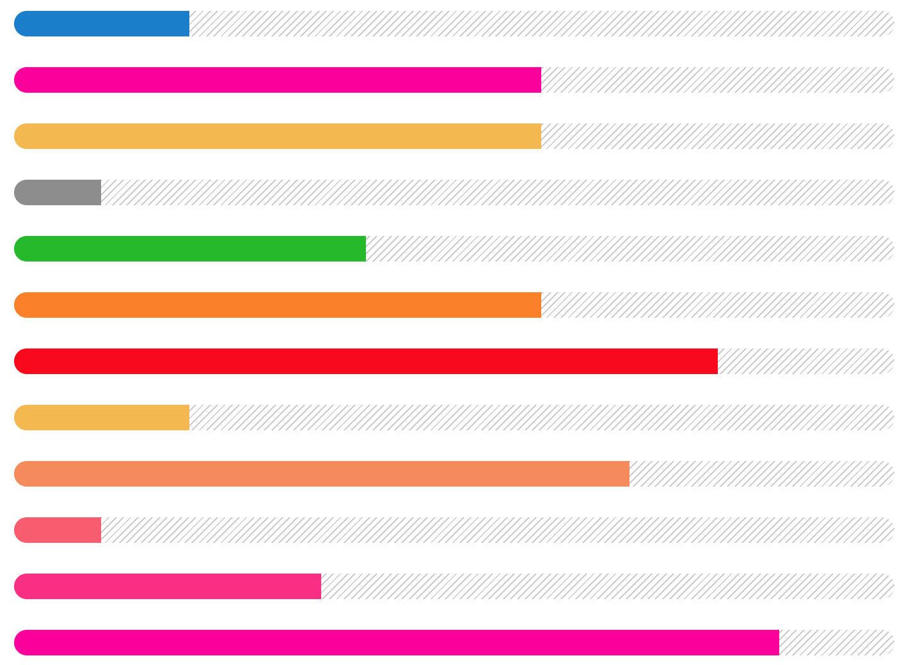

# Progress


A bitch that shows progress using **.progress** and  **.progress-bar**

```html
<div class="progress">
	<div class="progress-bar" style="width: 10%"></div>
</div>
```

## Colors

To color the progress, add `.badge-[color-tag]` to `.progress-bar`

*	**`.progress-bar-base`**
*	**`.progress-bar-primary`**
*	**`.progress-bar-accent`**
*	**`.progress-bar-neutral`**
*	**`.progress-bar-error`**
*	**`.progress-bar-caution`**
*	**`.progress-bar-success`**
*	**`.progress-bar-intensity-1`**
*	**`.progress-bar-intensity-2`**
*	**`.progress-bar-intensity-3`**
*	**`.progress-bar-intensity-4`**
*	**`.progress-bar-intensity-5`**


```html
<div class="progress">
	<div class="progress-bar" style="width: 10%"></div>
</div>
<br>
<div class="progress">
	<div class="progress-bar progress-bar-base" style="width: 46%"></div>
</div>
<br>
<div class="progress">
	<div class="progress-bar progress-bar-primary" style="width: 20%"></div>
</div>
<br>
<div class="progress">
	<div class="progress-bar progress-bar-accent" style="width: 60%;"></div>
</div>
<br>
<div class="progress">
	<div class="progress-bar progress-bar-neutral" style="width: 10%"></div>
</div>
<br>
<div class="progress">
	<div class="progress-bar progress-bar-success" style="width: 40%"></div>
</div>
<br>
<div class="progress">
	<div class="progress-bar progress-bar-caution" style="width: 60%"></div>
</div>
<br>
<div class="progress">
	<div class="progress-bar progress-bar-error" style="width: 80%"></div>
</div>
<br>
<div class="progress">
	<div class="progress-bar progress-bar-intensity-1" style="width: 20%"></div>
</div>
<br>
<div class="progress">
	<div class="progress-bar progress-bar-intensity-2" style="width: 70%"></div>
</div>
<br>
<div class="progress">
	<div class="progress-bar progress-bar-intensity-3" style="width: 10%"></div>
</div>
<br>
<div class="progress">
	<div class="progress-bar progress-bar-intensity-4" style="width: 35%"></div>
</div>
<br>
<div class="progress">
	<div class="progress-bar progress-bar-intensity-5" style="width: 87%"></div>
</div>
```



the color can be customized by adding a background-color property to `.progress-bar`

```html

<div class="progress">
	<div class="progress-bar progress-bar-base" style="background-color:pink;"></div>
</div>
```


## Animating

To animate the background, add `.active` to the **`.progress`**

```html
<div class="progress active">
	<div class="progress-bar progress-bar-primary" style="width: 20%"></div>
</div>
```


## Stacking

you can also stack **`.progress-bar`** elements

```html
<div class="progress">
	<div class="progress-bar progress-bar-success" style="width: 35%"></div>
	<div class="progress-bar progress-bar-error" style="width: 20%"></div>
	<div class="progress-bar progress-bar-caution" style="width: 10%"></div>
</div>
```


## Customizing


[Back to TOC](../../../readme.md)