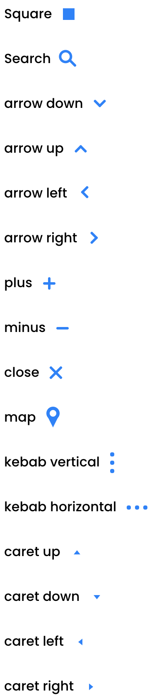

# Symbol

**`.symbol`** adds css built characters ready for your iconography


```html
<p>
Edit <i class="color-primary symbol symbol-edit"></i>
</p>

<p>
Delete <i class="color-primary symbol symbol-delete"></i>
</p>
		
		
<p>
Play <i class="color-primary symbol symbol-play"></i>
</p>

<p>
Pause <i class="color-primary symbol symbol-pause"></i>
</p>

<p>
Stop <i class="color-primary symbol symbol-stop"></i>
</p>

<p>
Square <i class="color-primary symbol symbol-square"></i>
</p>

<p>
Search <i class="color-primary symbol symbol-search"></i>
</p>

<p>
Time <i class="color-primary symbol symbol-time"></i>
</p>

<p>
Timer <i class="color-primary symbol symbol-timer"></i>
</p>

<p>
plus <i class="color-primary symbol symbol-plus"></i>
</p>

<p>
minus <i class="color-primary symbol symbol-minus"></i>
</p>

<p>
check <i class="color-primary symbol symbol-check"></i>
</p>

<p>
close <i class="color-primary symbol symbol-close"></i>
</p>

<p>
map <i class="color-primary symbol symbol-map"></i>
</p>

<p>
star <i class="color-primary symbol symbol-star"></i>
</p>
<p>
star <i class="color-primary symbol symbol-star-half"></i>
</p>
<p>
star <i class="color-primary symbol symbol-star-stroke"></i>
</p>

<p>
download <i class="color-primary symbol symbol-download"></i>
</p>

<p>
hyperlink <i class="color-primary symbol symbol-hyperlink"></i>
</p>

<p>
burger <i class="color-primary symbol symbol-burger"></i>
</p>

<p>
fries <i class="color-primary symbol symbol-fries"></i>
</p>

<p>
kebab vertical <i class="color-primary symbol symbol-kebab-vertical"></i>
</p>

<p>
kebab horizontal <i class="color-primary symbol symbol-kebab-horizontal"></i>
</p>

<p>
arrow down <i class="color-primary symbol symbol-arrow-down"></i>
</p>

<p>
arrow up <i class="color-primary symbol symbol-arrow-up"></i>
</p>

<p>
arrow left <i class="color-primary symbol symbol-arrow-left"></i>
</p>

<p>
arrow right <i class="color-primary symbol symbol-arrow-right"></i>
</p>

<p>
arrow double down <i class="color-primary symbol symbol-arrow-double-down"></i>
</p>

<p>
arrow double up <i class="color-primary symbol symbol-arrow-double-up"></i>
</p>

<p>
arrow double left <i class="color-primary symbol symbol-arrow-double-left"></i>
</p>

<p>
arrow double right <i class="color-primary symbol symbol-arrow-double-right"></i>
</p>

<p>
caret up <i class="color-primary symbol symbol-caret-up"></i>
</p>

<p>
caret down <i class="color-primary symbol symbol-caret-down"></i>
</p>

<p>
caret left <i class="color-primary symbol symbol-caret-left"></i>
</p>

<p>
caret right <i class="color-primary symbol symbol-caret-right"></i>
</p>

<p>
text center <i class="color-primary symbol symbol-text-center"></i>
</p>

<p>
text left <i class="color-primary symbol symbol-text-left"></i>
</p>

<p>
text right <i class="color-primary symbol symbol-text-right"></i>
</p>

<p>
text justify <i class="color-primary symbol symbol-text-justify"></i>
</p>
```




## Toggle classes

The symbols be toggled to another symbol class when a direct parent has a class of either `.active` or `.open` by just appending  `-toggle` to a symbol class (eg. `symbol-arrow-down-toggle`)

```html
<ul>
	<li>
		when this li is active,. the caret switchs from right to left O: &nbsp;<i class="color-primary symbol symbol-caret-right  symbol-caret-left-toggle"></i>
	</li>
</ul>
```


[Back to TOC](../../../readme.md)