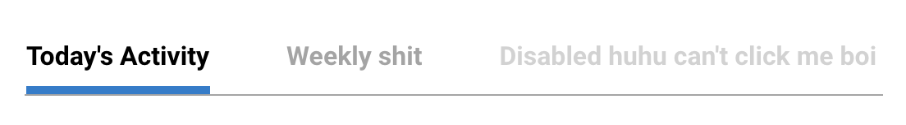

# Tabs

yes. to make it happen. have a block with `.tabs`

its children are `.tab`

All `.tab`s will have a child of `.tab-text` or an `<a>` tag

```html
<div class="tabs">
  <div class="tab active">
    <span href="#today">Today's Activity</span>
  </div>
  <div class="tab">
    <a href="#week">Weekly shit</a>
  </div>
  <div class="tab tab-disabled">
    <a href="#porn">Disabled huhu can't click me boi</a>
  </div>
</div>
```

Or if you're feeling too lazy, just a `<ul>` with `li.tab`s with `.tab-text` or `<a>` hids is fine too

```html
<ul class="tabs">
  <li class="tab active">
    <span class="tab-text" href="#today">Today's Activity</span>
  </li>
  <li class="tab ">
    <a href="#week">Weekly shit</a>
  </li>
  <li class="tab tab-disabled">
    <a href="#porn">Disabled huhu can't click me boi</a>
  </li>
</ul>
```



## Classes/ Elements

### `.tabs`

Container of ya boi

#### `.tabs-responsive`

Class to add to `.tabs`. Stacks the tabs on mobile breakpoint


[See breakpoint documentation](../../../docs/sections/scaffolding/breakpoint.md)

### `.tab`

or `<li>` child of `.tabs`. makes shit look like tabs.

On click, a class of `.active` is toggled

Except for `.tab-disabled`. because this bitch, you're not even suppose to click

#### `.tab-disabled`

Class to add to `.tab`. Disables clicking ya boi

### `.tab-text`

or `<a>` child of `.tab`. speshal styles for ur needs

## Accordion usage

Best practice for accordions to work seamlessly

```html
<div class="accordion-group accordion-group-no-close">
  <ul class="tabs	tabs-responsive">
    <li class="tab open" data-toggle-accordion data-href="#activity-log-today">
      <a href="#activity-log-today">Today's Activity</a>
    </li>
    <li class="tab" data-toggle-accordion data-href="#activity-log-week">
      <a href="#activity-log-week">Weekly Timesheet</a>
    </li>
    <li class="tab tab-disabled" data-toggle-accordion data-href="#porn">
      <a href="#porn">Disabled huhu can't click me boi</a>
    </li>
  </ul>

  <div class="accordion open" id="activity-log-today">todee</div>

  <div class="accordion" id="activity-log-week">weeku</div>

  <div class="accordion" id="porn">omg mom get out</div>
</div>
```

[See accordion documentation](../../../docs/sections/components/accordion.md)

## Javascript

### Functions

#### **`fw.Tabs(element)`**

Make a new boi by going `const tabs = new fw.Tabs(element)`

`element` is the `.tabs` itself. if blank, does nothing

#### **`tabs.activate(target,element)`**

duh

`target` is the tab item to activate. if blank, does nothing

`element` is the element triggered. if left blank, this defaults to the element attached to the instance

#### **`fw.Tabs.initListeners()`**

initializes all event listeners

### Events

- `click_fw_tabs` - happens on `triggerer`

- `before_activate_fw_tabs` - happens on `element` before activate
- `activate_fw_tabs` - happens on `element` when activate
- `after_activate_fw_tabs` - happens on `element` after activate

[Back to TOC](../../../readme.md)
