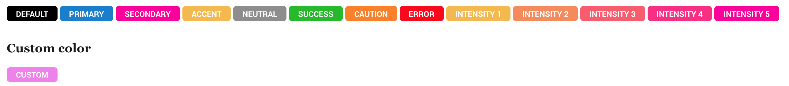

# Tags

This is to display.. a circle boi.. :)

```html
<span class="tag tag-primary"></span> Primary 
```


## Colors

To color the tags, add `.tag-[color-tag]`

*	**`.tag-base`**
*	**`.tag-primary`**
*	**`.tag-accent`**
*	**`.tag-neutral`**
*	**`.tag-error`**
*	**`.tag-caution`**
*	**`.tag-success`**
*	**`.tag-intensity-1`**
*	**`.tag-intensity-2`**
*	**`.tag-intensity-3`**
*	**`.tag-intensity-4`**
*	**`.tag-intensity-5`**



More info on [color tags](../scaffolding/colors.md#color-tags)

The color can be customized by adding a background-color property to the tag

```html
<span class="tag" style="background-color:pink;"></span> Primary 
```


[Back to TOC](../../../readme.md)