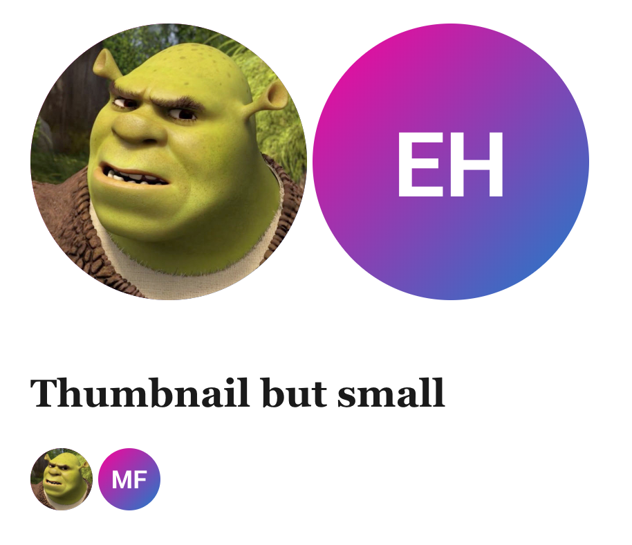

# Thumbnails

Useful for displaying profile images and such. use **`.thumbnail`**

```html
<!-- img setup -->
<a class="thumbnail" href="#">
  <div class="thumbnail-image">
    
  </div>
</a>

<!-- text setup -->
<a class="thumbnail" href="#">
  <span class="thumbnail-text"> eh </span>
</a>
```

To make them small, add **`.thumbnail-micro`**

```html
<!-- img setup -->
<a class="thumbnail" href="#">
  <div class="thumbnail-image">
    
  </div>
</a>

<!-- text setup -->
<a class="thumbnail" href="#">
  <span class="thumbnail-text"> mf </span>
</a>

<!-- Small -->
<a class="thumbnail thumbnail-small" href="#">
  <span class="thumbnail-text"> mf </span>
</a>

<!-- Smaller... like micro -->
<a class="thumbnail thumbnail-micro" href="#">
  <span class="thumbnail-text"> mf </span>
</a>
```



## Children elements

### **`.thumbnail-image`**

wrapper for image so it doesn't overflow its shapeful wonder

### **`.thumbnail-text`**

wrapper for initials or text to contain within the boi

[Back to TOC](../../../readme.md)
