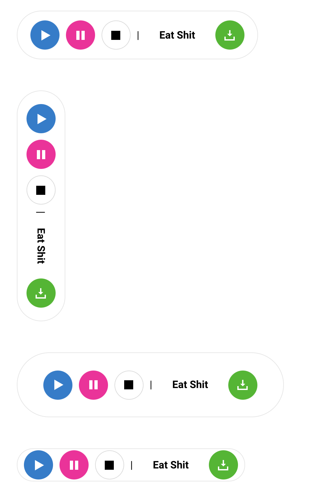

# Toolbar

it's what it is

```html
<div class="toolbar toolbar-horizontal">
	<span class="toolbar-tile">
		<a href="#" class="btn btn-symbol btn-primary">
			<i class="symbol symbol-play"></i>
		</a>
	</span>
	<span class="toolbar-tile">
		<a href="#" class="btn btn-symbol btn-secondary">
			<i class="symbol symbol-pause"></i>
		</a>
	</span>
	<span class="toolbar-tile">
		<a href="#" class="btn btn-symbol btn-default">
			<i class="symbol symbol-stop"></i>
		</a>
	</span>
	<span class="toolbar-tile">|</span>
	<span class="toolbar-tile">
		<div class="btn">Eat Shit</div>
	</span>
	<span class="toolbar-tile">
		<a href="#" class="btn btn-symbol btn-success">
			<i class="symbol symbol-download"></i>
		</a>
	</span>
</div>

<div class="toolbar toolbar-vertical">
	<span class="toolbar-tile">
		<a href="#" class="btn btn-symbol btn-primary">
			<i class="symbol symbol-play"></i>
		</a>
	</span>
	<span class="toolbar-tile">
		<a href="#" class="btn btn-symbol btn-secondary">
			<i class="symbol symbol-pause"></i>
		</a>
	</span>
	<span class="toolbar-tile">
		<a href="#" class="btn btn-symbol btn-default">
			<i class="symbol symbol-stop"></i>
		</a>
	</span>
	<span class="toolbar-tile">|</span>
	<span class="toolbar-tile">
		<div class="btn">Eat Shit</div>
	</span>
	<span class="toolbar-tile">
		<a href="#" class="btn btn-symbol btn-success">
			<i class="symbol symbol-download"></i>
		</a>
	</span>
</div>
```


## Classes

### **`.toolbar`**

Ya boi. add `.toolbar-horizontal` or  `.toolbar-vertical` To this to set an orientation

Ya boi. add `.toolbar-small` or  `.toolbar-large` To this to set its size opposite the orientation

### **`.toolbar-tile`**

Container for your input fields or buttons or some shit so it's spaced out of its fellow butts


