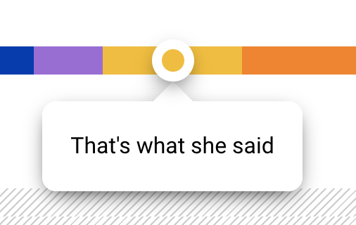

# Tooltip

Oh shit we have tooltis too. This dipshit can be toglled wether on click with **`[data-toggle-tooltip-click]`** or hover with **`[data-toggle-tooltip-hover]`**

NOTE: The toggler for the tooltip mus not be a `position:fixed;` or a descendant of an element with that property unless you want your tooltip to dIE... or position itself like shit

Example tooltip that toggles on click

```html
<a
  href="#"
  class="btn btn-primary"
  data-toggle-tooltip-click
  data-tooltip-placement="top"
  data-tooltip-content="<strong>YEET</strong>"
>
  Bitch boi on the top
</a>
```

A bitch boy toggled on hover

```html
<a
  href="#"
  class="btn btn-primary"
  data-toggle-tooltip-hover
  data-tooltip-placement="top"
  data-tooltip-content="<strong>YEET</strong>"
>
  Bitch boi on the top
</a>
```


# Toggler

**`[data-toggle-tooltip-click]`** or **`[data-toggle-tooltip-hover]`** depending on how the fuck you want it to appear. This shit makes it happen. Add this to the element you need to hava a tooltip on

```html
<span data-toggle-tooltip-hover></span>
```

This makes a tooltip, but there's nothing in it yet because you need...

# Attributes/Settings

## **`data-tooltip-placement`** - `args.placement`

defaults to `left`

It places the boi somewhere you want

Other Available parameters: `top`,`bottom`,`right`,

## **`data-tooltip-badge`** - `args.badge`

defaults to false

Whether or not you want the tooltip's pointy boi have a [badge](../components/badge.md) element on it

## **`data-tooltip-badge-background`** - `args.badgeBg`

defaults to `'primary'`

This sets a color on the badge boi

Only useful if `data-tooltip-badge` is true. It accepts valid [color tags](../scaffolding/colors.md#color-tags) values or valid `background-color` value

## **`data-tooltip-badge-size`** - `args.badgeSize`

defaults to `''`

How big do you want the boi?

Other Available parameters: `small`,`large`

## **`data-tooltip-classes`** - `args.classes`

Idk this is how you add classes or [helper classes](../../../readme.md#helpers-o-lawd) to the tooltip content but you have to be careful because some css may not work on the tooltip

## **`data-tooltip-content`** - `args.content`

defaults to `''`

This is the content for the tooltip

## **`data-tooltip-center-x`** - `args.centerX`

By default tooltips attaches the tip by the edge, enable this to center the tooltips tail or badge if enabled horizontally. NOTE: will not work if `data-tooltip-x` is set

## **`data-tooltip-center-y`** - `args.centerY`

By default tooltips attaches the tip by the edge, enable this to center the tooltips tail or badge if enabled vertically. NOTE: will not work if `data-tooltip-y` is set



## **`data-tooltip-inverse`** - `args.inverse`

use inverse theme

## **`data-tooltip-size`** - `args.size`

duh. leave blank or `large` or `small`

## **`data-tooltip-x`** - `args.x`

Custom x offset. has to be a number,

NOTE: the tooltip is appended to the body so position ofset will be calculated based on the body

## **`data-tooltip-y`** - `args.y`

Custom y offset. has to be a number,

NOTE: the tooltip is appended to the body so position ofset will be calculated based on the body

## **`data-tooltip-width`** - `args.width`

duh

## **`data-tooltip-allow-interaction`** - `args.allowInteraction`

defaults to false. tooltips are disabled for pointer interactions so it doesn't get in the way of the clickiness of elements in the page. set to tru so you can interact with things in it

# Advanced

## Modal markup

This is the markup our framework generates in case you need to make your own.

```html
<!-- Wrapper and color overlay... adding .active shows the boi.. tooltip-[position] styles the tooltip tail's position -->
<div class="tooltip tooltip-top active">
  <div class="tooltip-content">
    <!-- content here -->
  </div>
</div>
```

## Styling a tooltip

you can try but be careful

## Javascript

### Functions

#### **`fw.Tooltip(element)`**

Make a new boi by going `const tooltip = new fw.Tooltip(triggerElement,args)`

`triggerElement` is the tooltip triggerer. if blank, does nothing

`args` is the settings above available

```js
//defaults
{
	placement: 'left', //data-tooltip-placement
	badge: false, //data-tooltip-badge
	badgeBg: 'primary', //data-tooltip-badge-background
	badgeSize: '', //
	classes: '', //data-tooltip-classes
	inverse:false, //data-tooltip-inverse
	size: '', //data-tooltip-size
	content: '<em class="color-neutral tooltip-placeholder">No info...</em>', //data-tooltip-content
	centerX: false, //data-tooltip-center-x
	centerY: false, //data-tooltip-center-y
	x: false, //data-tooltip-x
	y: false, //data-tooltip-y
	width: null, //data-tooltip-width
	allowInteraction: false //data-tooltip-allow-interaction
}
```

#### **`tooltip.create(element)`**

duh

`element` is the element that triggers the tooltip

#### **`tooltip.destroy()`**

destroys currently active tooltip

#### **`tooltip.position(x,y)`**

positions ya boi based on whatever you put there. defaults to offsetting from the triggerter if coordinates are empty

#### **`tooltip.elementOrigin`**

gets {x,y} offset for tooltip based on triggerElement's position

### Events

- `click_fw_tooltip` - happens on `data-toggle-tooltip-click`
- `mouseenter_fw_tooltip` - happens on `data-toggle-tooltip-hover`
- `mouseleave_fw_tooltip` - happens on `data-toggle-tooltip-hover`
- `click_fw_tooltip_purge` - happens on elements that qualify closing tooltip-click components
- `before_create_fw_tooltip` - happens on `element` before create
- `create_fw_tooltip` - happens on `element` when create
- `after_create_fw_tooltip` - happens on `element` after create
- `before_destroy_fw_tooltip` - happens on `element` before destroy
- `destroy_fw_tooltip` - happens on `element` when destroy
- `after_destroy_fw_tooltip` - happens on `element` after destroy
- `before_position_fw_tooltip` - happens on `element` before position
- `position_fw_tooltip` - happens on `element` when position
- `after_position_fw_tooltip` - happens on `element` after position

[Back to TOC](../../../readme.md)
