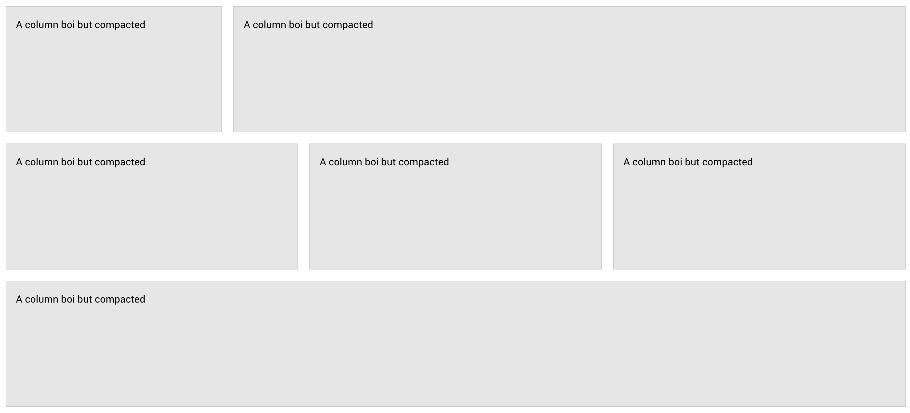
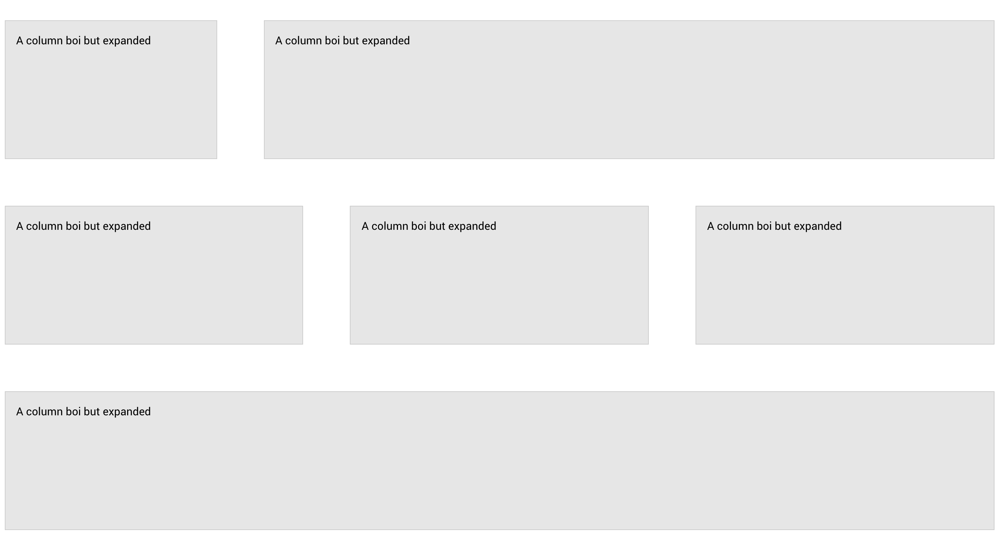
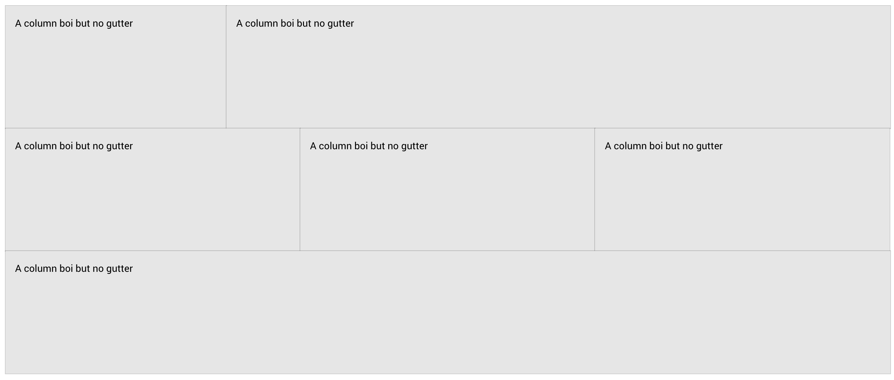
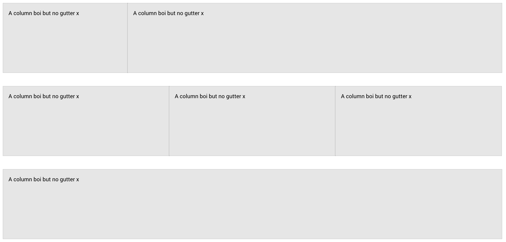
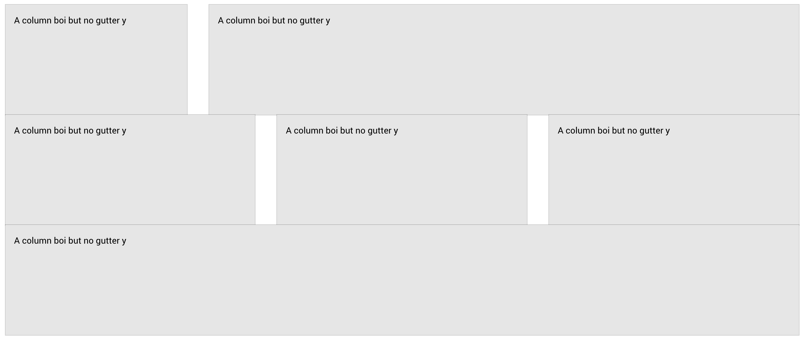
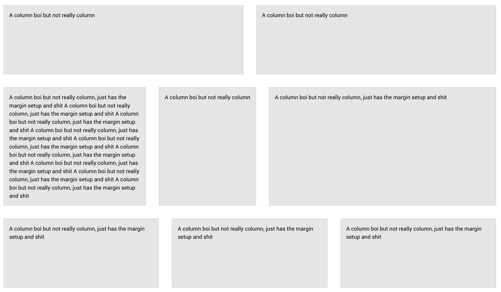

# Flex Grid

The framework has a grid setup using flex. No floats. because sadness. The columns are calculated by flex basis and spaces are setup by margins. As long as the box-sixing reset is not removed or reset from the framework. ya good.

[More info on flex](https://css-tricks.com/snippets/css/a-guide-to-flexbox/)


```html
<div class="grid grid-default">
  <div class="grid-col-12 grid-col-sm-6 grid-col-md-4 grid-col-lg-3">A column boi</div>
  <div class="grid-col-12 grid-col-sm-6 grid-col-md-8 grid-col-lg-9">A column boi</div>
  <div class="grid-col-12 grid-col-md-4">A column boi</div>
  <div class="grid-col-12 grid-col-md-4">A column boi</div>
  <div class="grid-col-12 grid-col-md-4">A column boi</div>
  <div class="grid-col-12 grid-col-md-4">A column boi</div>
</div>
```

## Container classes

### **`.grid`**

Initiates grid setup for parent element. Can setup grid system in three ways:
* Grid - add `.grid-default` to `.grid` for constricted layout
* Flex/ Classic - add `.grid-flex` to `.grid` to allow columns to grow and shrink as desired
* Masonry - add `.grid-masonry` to `.grid` for top bottom, then left to right flow for a masonry appearance (order weill not make sense)

No floats ew

```html
<!-- Default -->
<div class="grid grid-default">
  <div class="grid-col-12 grid-col-sm-6 grid-col-md-4 grid-col-lg-3">A column boi</div>
  <div class="grid-col-12 grid-col-sm-6 grid-col-md-8 grid-col-lg-9">A column boi</div>
  <div class="grid-col-12 grid-col-md-4">A column boi</div>
  <div class="grid-col-12 grid-col-md-4">A column boi</div>
  <div class="grid-col-12 grid-col-md-4">A column boi</div>
  <div class="grid-col-12 grid-col-md-4">A column boi</div>
</div>
<!-- Flex/ Classic -->
<div class="grid grid-flex">
  <div class="grid-col-12 grid-col-sm-6 grid-col-md-4 grid-col-lg-3">A column boi</div>
  <div class="grid-col-12 grid-col-sm-6 grid-col-md-8 grid-col-lg-9">A column boi</div>
  <div class="grid-col-12 grid-col-md-4">A column boi</div>
  <div class="grid-col-12 grid-col-md-4">A column boi</div>
  <div class="grid-col-12 grid-col-md-4">A column boi</div>
  <div class="grid-col-12 grid-col-md-4">A column boi</div>
</div>
<!-- Masonry -->
<div class="grid grid-masonry">
  <div class="grid-col-12 grid-col-sm-6 grid-col-md-4 grid-col-lg-3">A column boi</div>
  <div class="grid-col-12 grid-col-sm-6 grid-col-md-8 grid-col-lg-9">A column boi</div>
  <div class="grid-col-12 grid-col-md-4">A column boi</div>
  <div class="grid-col-12 grid-col-md-4">A column boi</div>
  <div class="grid-col-12 grid-col-md-4">A column boi</div>
  <div class="grid-col-12 grid-col-md-4">A column boi</div>
</div>
```

### Helper classes

#### **`.grid-compact`** and **`.grid-expanded`**

Modifies grid item spacing.

**`.grid-compact`** makes it less spaced out



```html
<div class="grid grid-flexgrid-compact">
  <div class="grid-col-12 grid-col-sm-6 grid-col-md-4 grid-col-lg-3">
    A column boi but compact
  </div>
  <div class="grid-col-12 grid-col-sm-6 grid-col-md-8 grid-col-lg-9">
    A column boi but compact
  </div>
  <div class="grid-col-12 grid-col-md-4">A column boi but compact</div>
  <div class="grid-col-12 grid-col-md-4">A column boi but compact</div>
  <div class="grid-col-12 grid-col-md-4">A column boi but compact</div>
  <div class="grid-col-12 grid-col-md-4">A column boi but compact</div>
</div>
```

**`.grid-expanded`** makes it mORE SPACED OUT HOHO



```html
<div class="grid grid-flexgrid-expanded">
  <div class="grid-col-12 grid-col-sm-6 grid-col-md-4 grid-col-lg-3">
    A column boi but expanded
  </div>
  <div class="grid-col-12 grid-col-sm-6 grid-col-md-8 grid-col-lg-9">
    A column boi but expanded
  </div>
  <div class="grid-col-12 grid-col-md-4">A column boi but expanded</div>
  <div class="grid-col-12 grid-col-md-4">A column boi but expanded</div>
  <div class="grid-col-12 grid-col-md-4">A column boi but expanded</div>
  <div class="grid-col-12 grid-col-md-4">A column boi but expanded</div>
</div>
```

#### **`.grid-constricted`**, and **`.grid-constricted-x`** or **`.grid-constricted-y`**

Use classes to remove margins

**`.grid-constricted`** removes all gaps



```html
<div class="grid grid-flexgrid-constricted">
  <div class="grid-col-12 grid-col-sm-6 grid-col-md-4 grid-col-lg-3">
    A column boi but no gutter
  </div>
  <div class="grid-col-12 grid-col-sm-6 grid-col-md-8 grid-col-lg-9">
    A column boi but no gutter
  </div>
  <div class="grid-col-12 grid-col-md-4">A column boi but no gutter</div>
  <div class="grid-col-12 grid-col-md-4">A column boi but no gutter</div>
  <div class="grid-col-12 grid-col-md-4">A column boi but no gutter</div>
  <div class="grid-col-12 grid-col-md-4">A column boi but no gutter</div>
</div>
```

**`.grid-constricted-x`** removes gaps horizontally



```html
<div class="grid grid-flexgrid-constricted-x">
  <div class="grid-col-12 grid-col-sm-6 grid-col-md-4 grid-col-lg-3">
    A column boi but no gutter x
  </div>
  <div class="grid-col-12 grid-col-sm-6 grid-col-md-8 grid-col-lg-9">
    A column boi but no gutter x
  </div>
  <div class="grid-col-12 grid-col-md-4">A column boi but no gutter x</div>
  <div class="grid-col-12 grid-col-md-4">A column boi but no gutter x</div>
  <div class="grid-col-12 grid-col-md-4">A column boi but no gutter x</div>
  <div class="grid-col-12 grid-col-md-4">A column boi but no gutter x</div>
</div>
```

**`.grid-constricted-y`** removes gaps vertically



```html
<div class="grid grid-flexgrid-constricted-y">
  <div class="grid-col-12 grid-col-sm-6 grid-col-md-4 grid-col-lg-3">
    A column boi but no gutter y
  </div>
  <div class="grid-col-12 grid-col-sm-6 grid-col-md-8 grid-col-lg-9">
    A column boi but no gutter y
  </div>
  <div class="grid-col-12 grid-col-md-4">A column boi but no gutter y</div>
  <div class="grid-col-12 grid-col-md-4">A column boi but no gutter y</div>
  <div class="grid-col-12 grid-col-md-4">A column boi but no gutter y</div>
  <div class="grid-col-12 grid-col-md-4">A column boi but no gutter y</div>
</div>
```

### **`.grid-flex-fixed`**

sub helper for `.grid-flex`. By default flex grid items will grow and shrink depending on available blank space, to have a fixed column layout use that class up ther


```html
<div class="grid grid-flexgrid-flex-fixed">
  <div class="grid-col-12 grid-col-sm-6 grid-col-md-4 grid-col-lg-3">
    A column boi but fixed
  </div>
  <div class="grid-col-12 grid-col-sm-6 grid-col-md-8 grid-col-lg-9">
    A column boi but fixed
  </div>
  <div class="grid-col-12 grid-col-md-4">A column boi but fixed</div>
  <div class="grid-col-12 grid-col-md-4">A column boi but fixed</div>
  <div class="grid-col-12 grid-col-md-4">A column boi but fixed</div>
  <div class="grid-col-12 grid-col-md-4">A column boi but fixed</div>
</div>
```

### Other helpers

The container also supports the following helper classes

- [Justify Content](../helpers/justify.md#justify-content)
- [Align Items](../helpers/align.md#align-items)
- [Align Content](../helpers/align.md#align-content)
- [Flex wrap](../helpers/flex.md#flex-wrap)
- [Flex direction](../helpers/gap.md#flex-direction)
- [Flex direction](../helpers/flex.md#flex-direction)

## Children classes

### **`.grid-col-[number]`** and **`.grid-col-[breakpoint]-[number]`**

#### Basic Layout

The number suffix of the class is based on the amount of space out of the set `$grid-units` will be taken

By default `$grid-units` is 12 (see [customize](../setup/customize.md));

so for example, if a class of `.grid-col-6` is declared, this column item will take 6/12 or 1/2 of the space

```html
<div class="grid grid-default">
  <div class="grid-col-6">
    <div class="grid-col-6"></div>
  </div>
</div>
```

I have no graphic to show you because i'm an asshole

#### Breakpoint based layout

See [Breakpoints](../scaffolding/breakpoint.md)

To change the flex basis of the column item on certain breakpoints, **`.grid-col-[breakpoint]-[number]`** is the best class to add.

Note that the grid setup is made mobile first, so the `.flex-col` class will cascade unto larger breakpoints unless a class for one of the larger breakpoints than the declared.. is declared.. woah I can english :O

```html
<div class="grid grid-default">
  <div class="grid-col-xs-12 grid-col-md-6">
    <div class="grid-col-xs-12 grid-col-md-6"></div>
  </div>
</div>
```

On this code, the column bois is set for full width on `xs` devices until `md` because on `md` they break into 2 columns now

#### **`.grid-col`**

Suppose you didn't want yuh flex items to be a set width or basis but rather shrink and or grow or not based on the content it has, but allow the usual grid spacing to happen, use `.grid-col`. Works best if `.grid` is `.grid-flex`



```html
<div class="grid grid-default">
  <div class="grid-col-6">A column boi but not really column</div>
  <div class="grid-col-6">A column boi but not really column</div>
  <div class="grid-col-3 flex-0-1">
    A column boi but not really column, just has the margin setup and shit A column boi
    but not really column, just has the margin setup and shit A column boi but not
    really column, just has the margin setup and shit A column boi but not really
    column, just has the margin setup and shit A column boi but not really column, just
    has the margin setup and shit A column boi but not really column, just has the
    margin setup and shit A column boi but not really column, just has the margin setup
    and shit A column boi but not really column, just has the margin setup and shit A
    column boi but not really column, just has the margin setup and shit
  </div>
  <div class="grid-col">A column boi but not really column</div>
  <div class="grid-col flex-1-1">
    A column boi but not really column, just has the margin setup and shit
  </div>
  <div class="grid-col-4">
    A column boi but not really column, just has the margin setup and shit
  </div>
  <div class="grid-col-4">
    A column boi but not really column, just has the margin setup and shit
  </div>
  <div class="grid-col-4">
    A column boi but not really column, just has the margin setup and shit
  </div>
</div>
```

Did I describe it right? idk, but that image should... clear up whatever I attempted to say

You can also use the grow and shrink helpers to dictate how much shrinkage and growage you want on them column bois

### Other helpers

The column bois also supports the following helper classes

- [Align Self](../helpers/align.md#align-self)
- [Grow and Shrink](../helpers/flex.md#grow-and-shrink)

[Back to TOC](../../../readme.md)
