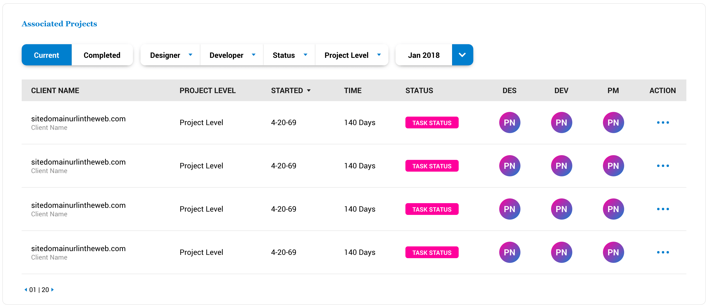
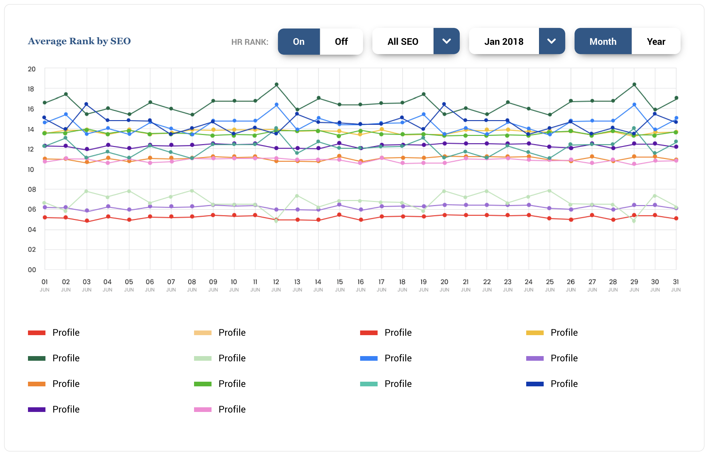

# Modules

These are boxes that hold content and are setup with css grid



Modules are containers of components and shit

This is a markup teplate of a basic bitch. 

```html
<div class="module">
    <div class="module-header">
        <h3 class="module-title">Title</h3>
        <div class="module-functions">

            <!-- Put buttons and shit here -->
            <div class="module-function">
                <button class="btn btn-primary">Do Some shit</button>
            </div>

            <div class="module-function">
                <button class="btn btn-primary">Do Some other shit</button>
            </div>
        </div>
    </div>
    <div class="module-content">
        <p>Hi I'm a piece of content</p>
    </div>
    <div class="module-footer">
        <p>Whatever footers have</p>
    </div>
</div>
```

Or go basic

```html
<div class="module">
    <p>Sup I'm a basic ass content boi</p>
</div>
```


## Module Elements


### **`.module-content`**

This is where you put module-contents. The block stretches to 1fr by default so flexing content is possible.


```html
<div class="module">
    <div class="module-content">
        Hi I'm content
    </div>
</div>
```

### **`.module-header`** and **`.module-footer`**

Duh


```html
<div class="module">

    <div class="module-header">
        Hi I'm header
    </div>
    <div class="module-content">
        Hi I'm content
    </div>

    <div class="module-footer">
        Hi I'm footer
    </div>
</div>
```

### **`.module-title`**

Typically placed in the `.module-header`. It's used to title your module


You can insert whatever functionalitites you need in the header and footer using...

####  **`.module-functions`**


Container for functions. Each [`.input`](../components/form.md) or [`.btn`](../components/button.md)  must be wrapped by **`.module-function`** So the layout looks nice


```html
<div class="module">

    <div class="module-header">
        <div class="module-functions">
            <div class="module-function">
                <div class=" input-group input-group-horizontal input-group-responsive">
                    <select class="input input-single-line">
                        <option value="" selected="">Select 1</option>
                        <option class="REPLACE" value="VAL">VAL</option>
                    </select>
                    
                    <select class="input input-single-line">
                        <option value="" selected="">Select 2</option>
                        <option class="REPLACE" value="VAL">VAL</option>
                    </select>
                    
                    <select class="input input-single-line">
                        <option value="" selected="">Select 3</option>
                        <option class="REPLACE" value="VAL">VAL</option>
                    </select>
                    
                    <select class="input input-single-line">
                        <option value="" selected="">Select 4</option>
                        <option class="REPLACE" value="VAL">VAL</option>
                    </select>
                </div>
            </div>
        </div>
    </div>
    <div class="module-content">
        Hi I'm content
    </div>

    <div class="module-footer">
        <div class="module-functions">
            <div class="module-function">
                <div class=" input-group input-group-horizontal input-group-responsive">
                    <select class="input input-single-line">
                        <option value="" selected="">Select 1</option>
                        <option class="REPLACE" value="VAL">VAL</option>
                    </select>
                    
                    <select class="input input-single-line">
                        <option value="" selected="">Select 2</option>
                        <option class="REPLACE" value="VAL">VAL</option>
                    </select>
                    
                    <select class="input input-single-line">
                        <option value="" selected="">Select 3</option>
                        <option class="REPLACE" value="VAL">VAL</option>
                    </select>
                    
                    <select class="input input-single-line">
                        <option value="" selected="">Select 4</option>
                        <option class="REPLACE" value="VAL">VAL</option>
                    </select>
                </div>
            </div>
        </div>
    </div>
</div>
```


### **`.module-header-break`** and **`.module-footer-break`**

This allows either header or footer to break into flex row layout So you can display things beside the module functions or some shit




# Module Grid

You can rearrange modules into a nice grid with the help of data attributes and shit


## `.module-grid`

A class to put on module containers to allow grid setup. The framework's javascript looks for this class to allow css grid setup. By default, the grid sets up all modules to full width single columns

```html
<div class="module-grid">

    <div class="module"></div>
    <div class="module"></div>
    <div class="module"></div>

</div>
```


## Data Attributes

Any valid css grid propery can be setup..

[More information on available css grid parent properties](https://css-tricks.com/snippets/css/complete-guide-grid/)

```html
<div class="module-grid" data-template-rows="50% 20px 1fr" data-grid-template-areas="'col1 col2 col3'">

    <div class="module" data-grid-area="col1"></div>
    <div class="module" data-grid-area="col2"></div>
    <div class="module" data-grid-area="col3"></div>

</div>
```

### Valid `.module-grid` data attributes

*   **`[data-grid-template-columns]`**
*   **`[data-grid-template-rows]`**
*   **`[data-grid-template-areas]`**
*   **`[data-grid-column-start]`**
*   **`[data-grid-template-end]`**
*   **`[data-grid-template]`**
*   **`[data-grid-column-gap]`**
*   **`[data-grid-row-gap]`**
*   **`[data-justify-items]`**
*   **`[data-align-items]`**
*   **`[data-justify-content]`**
*   **`[data-align-content]`**
*   **`[data-place-content]`**
*   **`[data-grid-auto-columns]`**
*   **`[data-grid-auto-rows]`**
*   **`[data-grid-auto-flow]`**
*   **`[data-grid]`**


### Valid `.module` data attributes

*   **`[grid-area]`**
*   **`[grid-column]`**
*   **`[grid-row]`**
*   **`[grid-column-start]`**
*   **`[grid-column-end]`**
*   **`[grid-row-start]`**
*   **`[grid-row-end]`**
*   **`[justify-self]`**
*   **`[align-self]`**
*   **`[place-self]`**


### Breakpoint setup

Like [flex grids](../layout/flexgrid.md), this is also setup mobile first. To set the grid property value on a specific breakpoint, append  the [breakpoint tag](../scaffolding/breakpoint.md) to the attribute

```html
<div class="module-grid" data-template-rows-sm="50% 20px 1fr" data-grid-template-areas-sm="'col1 col2 col3'">

    <div class="module" data-grid-area-sm="col1"></div>
    <div class="module" data-grid-area-sm="col2"></div>
    <div class="module" data-grid-area-sm="col3"></div>

</div>
```

## Other helpers

### Valid `.module-grid` helpers

*	[Justify Content](../scaffolding/helpers.md#justify-content)
*	[Align Items](../scaffolding/helpers.md#align-items)
*	[Align Content](../scaffolding/helpers.md#align-content)

### Valid `.module` helpers
*	[Align Self](../scaffolding/helpers.md#align-self)

Disclaimer I didn't setup css grid specific helpers because it completely slipped my dumbass mind whoopsie

This sets a weird column setup starting in the sm breakpoint

[Back to TOC](../../../readme.md)