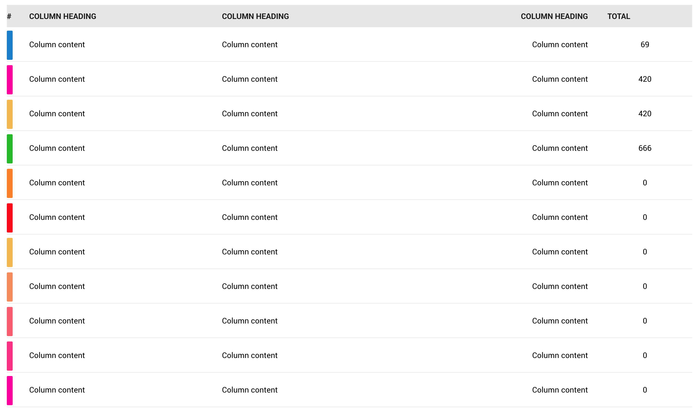
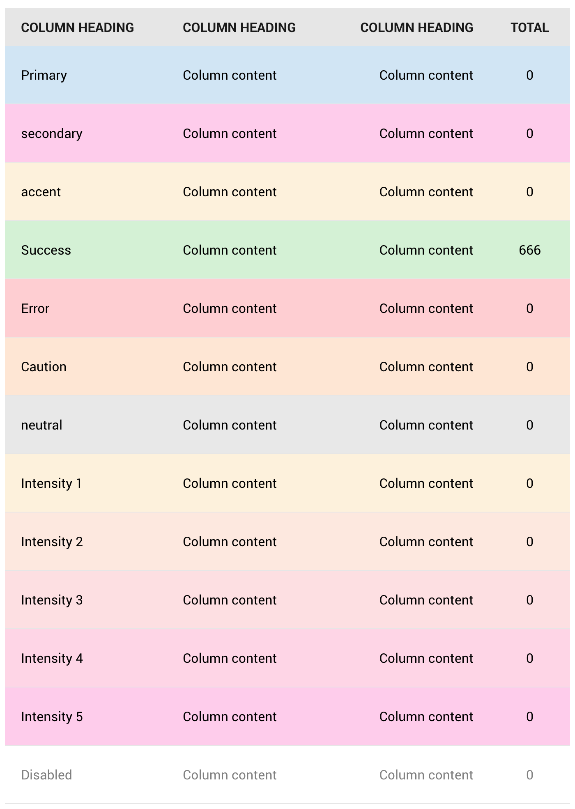

# Table



Yes we have that too.

## Helper Classes

### **.table-wrapper**

tables may not be absolutely responsive depending on content. to allow horizontal scrolling without looking ugly, wrap yuh table in a div with this class

```html
<div class="table-wrapper">
  <table>
    <!-- shet -->
  </table>
</div>
```

### **.table**

Replicate a `<table>` element

```html
<div class="table"></div>
```

### **.table-fixed**

add to `<table>` or `.table` element if you want it to be abso-fucking-lutely mushy

### **.table-row**

Replicate a `<thead>`,`<tbody>`,`<tfoot>` or `<tr>` element

```html
<div class="table">
  <div class="table-row"></div>
</div>
```

#### Row classes



##### Colors

The folloing classes style table rows to [framework colors](../scaffolding/colors.md#color-tags)

- **.table-row-primary**
- **.table-row-secondary**
- **.table-row-accent**
- **.table-row-neutral**
- **.table-row-success**
- **.table-row-caution**
- **.table-row-error**
- **.table-row-intensity-1**
- **.table-row-intensity-2**
- **.table-row-intensity-3**
- **.table-row-intensity-4**
- **.table-row-intensity-5**

```html
<table>
  <tr class="table-row table-row-success"></tr>
</table>
```

#### Cell classes


##### Colors

The following classes style a single table cell to [framework colors](../scaffolding/colors.md#color-tags)

- **.table-cell-primary**
- **.table-cell-secondary**
- **.table-cell-accent**
- **.table-cell-neutral**
- **.table-cell-success**
- **.table-cell-caution**
- **.table-cell-error**
- **.table-cell-intensity-1**
- **.table-cell-intensity-2**
- **.table-cell-intensity-3**
- **.table-cell-intensity-4**
- **.table-cell-intensity-5**

```html
<table>
  <tr class="table-row">
    <td class=" table-row-succes">weeee</td>
  </tr>
</table>
```

##### Disable

To add disabled styles to a row, add **`.table-row-disabled`** to the row

### **.table-cell**

Replicate a `<td>` or `<tr>` element

```html
<div class="table">
  <div class="table-row">
    <div class="table-cell">CELL!</div>
  </div>
</div>
```

### **.table-cell-heading**

Style a `<td>` or `.table-cell` as a `<tr>` element

```html
<div class="table">
  <div class="table-row">
    <div class="table-cell table-cell-heading">CELL!</div>
  </div>
  <div class="table-row">
    <div class="table-cell">CELL!</div>
  </div>
</div>
```

### **.table-cell-no-gutter**

Remove padding on table cell

```html
<div class="table-cell table-cell-no-gutter">CELL!</div>
```

### **`.table-large` and `.table-small`**

Add `.table-large` or `.table-small` to reduce or expand table rows and line height

### **`.table-label`**


Add tags on the side for more secondary. Works best with a cell classed ass [`.table-cell-no-gutter`](#table-cell-no-gutter).

This can be colorized with `.table-label-[color]` based on [framework colors](../scaffolding/colors.md#color-tags)

```html
<table class="table">
  <tbody>
    <tr>
      <td class="table-cell-no-gutter">
        <span class="table-label table-label-primary"></span>
      </td>
    </tr>
  </tbody>
</table>
```

Custom color labels can be added to by setting background color properties instead of color classes

```html
<table class="table">
  <tbody>
    <tr>
      <td class="table-cell-no-gutter">
        <span class="table-label" style="background-color:red;"></span>
      </td>
    </tr>
  </tbody>
</table>
```

[Back to TOC](../../../readme.md)
