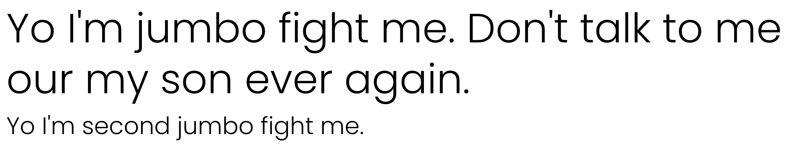

# Typography

## Text ultilities

See [Text Helpers](../helpeers/text.md)

## Text ultilities

See [Helpers](../helpeers/text.md)

## Headings

Why yes, they are all available

```html
<h1>Big bitch one</h1>
<h2>Big bitch two</h2>
<h3>Big bitch three</h3>
<h4>Not so big bitch four</h4>
<h5>bitch five</h5>
<h6>Lil bitch 6</h6>
```

If you want something that's not suppose to be a heading semantic-wise but styled as one, each heading has an available class

```html
<p class="h1">Big bitch one</p>
<p class="h2">Big bitch two</p>
<p class="h3">Big bitch three</p>
<p class="h4">Not so big bitch four</p>
<p class="h5">bitch five</p>
<p class="h6">Lil bitch 6</p>
```

## Special Text



There are classes available for jumbo text anc headings. `.special-primary`, `.special-secondary` and `.lead`. you get the idea

## Paragraphs

We have that too. If you want something that's not suppose to be a paragraph semantic-wise but styled as one, the clas `.p` is available for u <3

## Lists

The framework supports `ol` (Ordered lists),`ul` (Unorderde Lists), and `dl (yi forgot what it's actually called in human but yep, it's supported)

### Helper Classes

Ordered and Unordered lists have classes to remove or modify styles to your needs :')

- **`inline`**

  Inline all the list items and remove stylings

- **`.unstyled`**

  Removes or resets styles of list. Not to be confused with `.style-none`

- **`.style-none`**

  Removes list bullets or numbering but not padding styles. Not to be confused with unstyled

#### List Style

Ordered and unordered lists have classes available for list types

[More info on list styles](https://www.w3schools.com/cssref/pr_list-style-type.asp)

##### Ordered List helpers

- **`.style-decimal`** (Also default styles, but useful for re-normalizing lists)
- **`.style-decimal-leading-zero`**
- **`.style-lower-alpha`**
- **`.style-lower-roman`**
- **`.style-upper-alpha`**
- **`.style-upper-roman`**

##### Unordered List helpers

- **`.style-disc`** (Also default styles, but useful for re-normalizing lists)
- **`.style-circle`**
- **`.style-squeare`**

## Blockquote

We have that. just make a `<blockquote>` boi and ya good

## Horizontal Rules

the `<hr>` ? yes.

## Inline text

This to yes, we have

<p><strong>Address Tag</strong></p>
<address>1 Infinite Loop<br>
Cupertino, CA 95014<br>
United States</address>
<p><strong>Anchor Tag (aka. Link)</strong></p>
<p>This is an example of a <a title="Apple" href="http://apple.com">link</a>.</p>
<p><strong>Abbreviation Tag</strong></p>
<p>The abbreviation <abbr title="Seriously">srsly</abbr> stands for “seriously”.</p>
<p><strong>Acronym Tag</strong></p>
<p>The acronym <acronym title="For The Win">ftw</acronym> stands for “for the win”.</p>
<p><strong>Big Tag</strong></p>
<p>These tests are a <big>big</big> deal, but this tag is no longer supported in HTML5.</p>
<p><strong>Cite Tag</strong></p>
<p>“Code is poetry.” —<cite>Automattic</cite></p>
<p><strong>Code Tag</strong></p>
<p>You will learn later on in these tests that <code>word-wrap: break-word;</code> will be your best friend.</p>
<p><strong>Delete Tag</strong></p>
<p>This tag will let you <del>strikeout text</del>, but this tag is no longer supported in HTML5 (use the <code>&lt;strike&gt;</code> instead).</p>
<p><strong>Emphasize Tag</strong></p>
<p>The emphasize tag should <em>italicize</em> text.</p>
<p><strong>Insert Tag</strong></p>
<p>This tag should denote <ins>inserted</ins> text.</p>
<p><strong>Keyboard Tag</strong></p>
<p>This <a href="#">scarcely</a> known tag emulates <kbd>keyboard text</kbd>, which is usually styled like the <code>&lt;code&gt;</code> tag.</p>
<p><strong>Preformatted Tag</strong></p>
<p>This tag styles large blocks of code.</p>
<pre>.post-title {
	margin: 0 0 5px;
	font-weight: bold;
	font-size: 38px;
	line-height: 1.2;
}</pre>
<p><strong>Quote Tag</strong></p>
<p><q>Developers, developers, developers…</q> –Steve Ballmer</p>
<p><strong>Strong Tag</strong></p>
<p>This tag shows <strong>bold<strong> text.</strong></strong></p>
<p><strong>Subscript Tag</strong></p>
<p>Getting our science styling on with H<sub>2</sub>O, which should push the “2” down.</p>
<p><strong>Superscript Tag</strong></p>
<p>Still sticking with science and Isaac Newton’s E = MC<sup>2</sup>, which should lift the 2 up.</p>
<p><strong>Teletype Tag</strong></p>
<p>This rarely used tag emulates <tt>teletype text</tt>, which is usually styled like the <code>&lt;code&gt;</code> tag.</p>
<p><strong>Variable Tag</strong></p>
<p>This allows you to denote <var>variables</var>.</p>

```html
<address>
  1 Infinite Loop<br />
  Cupertino, CA 95014<br />
  United States
</address>

<p>This is an example of a <a title="Apple" href="http://apple.com">link</a>.</p>

<p>The abbreviation <abbr title="Seriously">srsly</abbr> stands for “seriously”.</p>

<p>The acronym <acronym title="For The Win">ftw</acronym> stands for “for the win”.</p>

<p>
  These tests are a <big>big</big> deal, but this tag is no longer supported in HTML5 .
</p>

<p>“Code is poetry.” —<cite>Automattic</cite></p>

<p>
  You will learn later on in these tests that <code>word-wrap: break-word;</code> will
  be your best friend.
</p>

<p>
  This tag will let you <del>strikeout text</del>, but this tag is no longer supported
  in HTML5 (use the <code>&lt;strike&gt;</code> instead).
</p>

<p>The emphasize tag should <em>italicize</em> text.</p>

<p>This tag should denote <ins>inserted</ins> text.</p>

<p>
  This <a href="#">scarcely</a> known tag emulates <kbd>keyboard text</kbd>, which is
  usually styled like the <code>&lt;code&gt;</code> tag.
</p>

<p>The pre tag styles large blocks of code.</p>
<pre>
	.post-title {
		margin: 0 0 5px;
		font-weight: bold;
		font-size: 38px;
		line-height: 1.2;
	}
</pre>

<p><q>Developers, developers, developers…</q> –Steve Ballmer</p>

<p>
  This tag shows <strong>bold<strong> text.</strong></strong>
</p>

<p>
  Getting our science styling on with H<sub>2</sub>O, which should push the “2” down.
</p>

<p>
  Still sticking with science and Isaac Newton’s E = MC<sup>2</sup>, which should lift
  the 2 up.
</p>

<p>
  This rarely used tag emulates <tt>teletype text</tt>, which is usually styled like the
  <code>&lt;code&gt;</code> tag.
</p>

<p>This allows you to denote <var>variables</var>.</p>
```

[Back to TOC](../../../readme.md)
