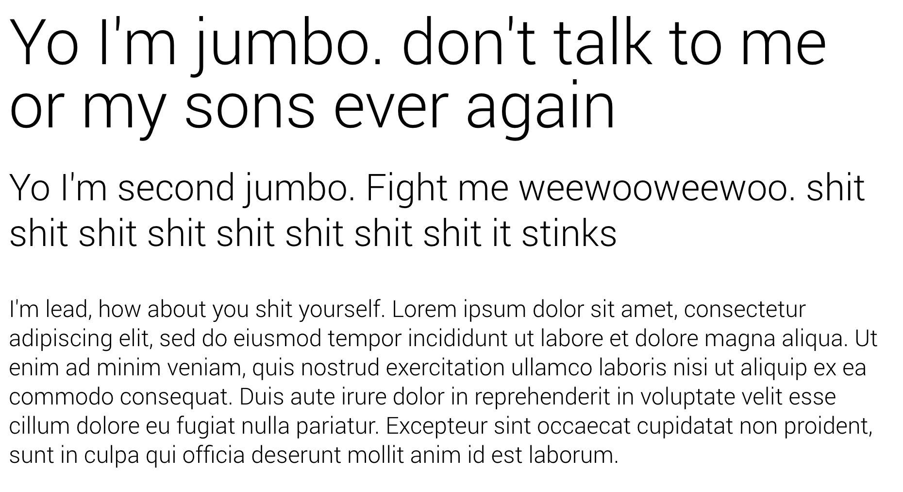

# Typography

## Headings

Why yes, they are all available	

```html
<h1>Big bitch one</h1>
<h2>Big bitch two</h2>
<h3>Big bitch three</h3>
<h4>Not so big bitch four</h4>
<h5>bitch five</h5>
<h6>Lil bitch 6</h6>
```

If you want something that's not suppose to be a heading semantic wise but styled as one, each heading has an available class


```html
<p class="h1">Big bitch one</p>
<p class="h2">Big bitch two</p>
<p class="h3">Big bitch three</p>
<p class="h4">Not so big bitch four</p>
<p class="h5">bitch five</p>
<p class="h6">Lil bitch 6</p>
```

## Special Text



There are classes available for jumbo text anc headings. `.special-primary`, `.special-secondary` and `.lead`. you get the idea


[Back to TOC](../../../readme.md)